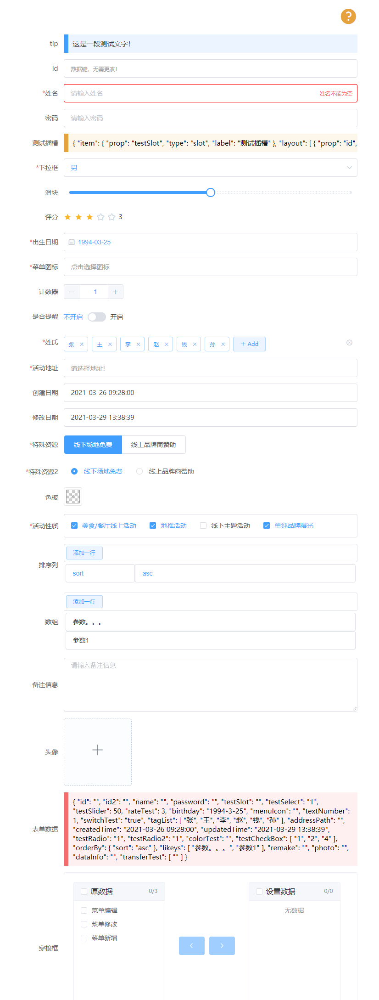
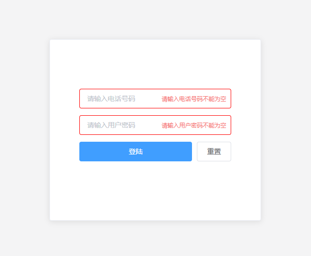
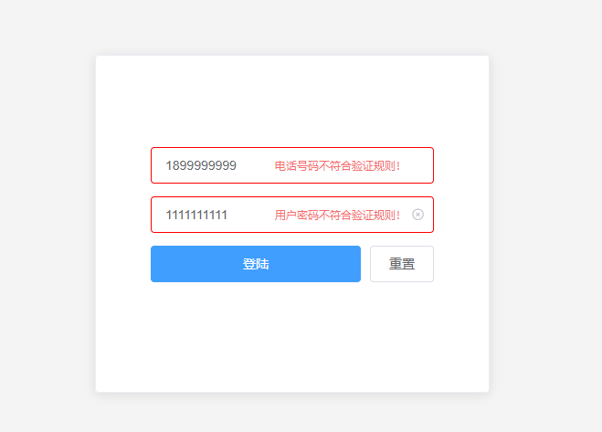
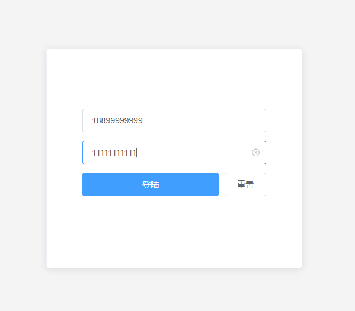
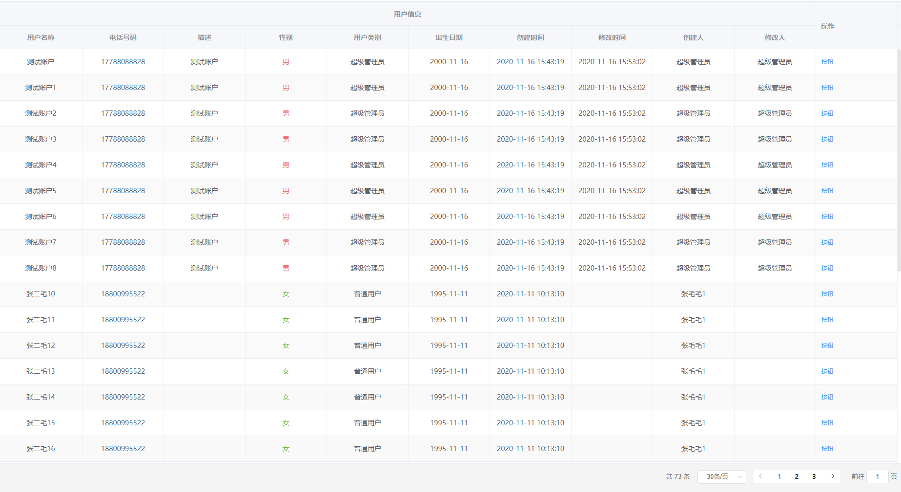
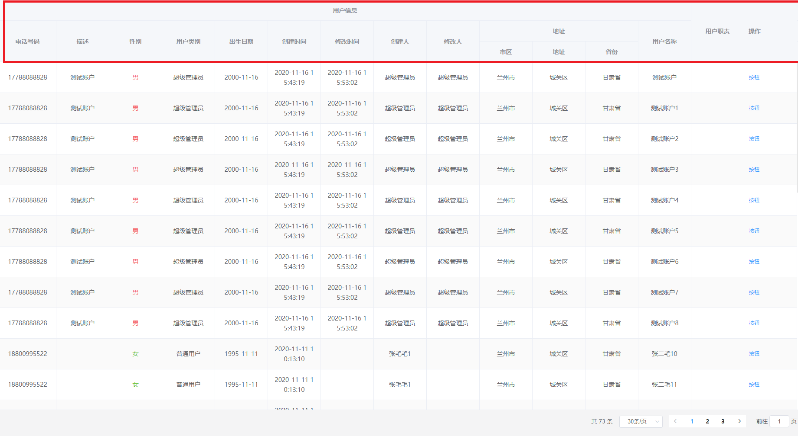
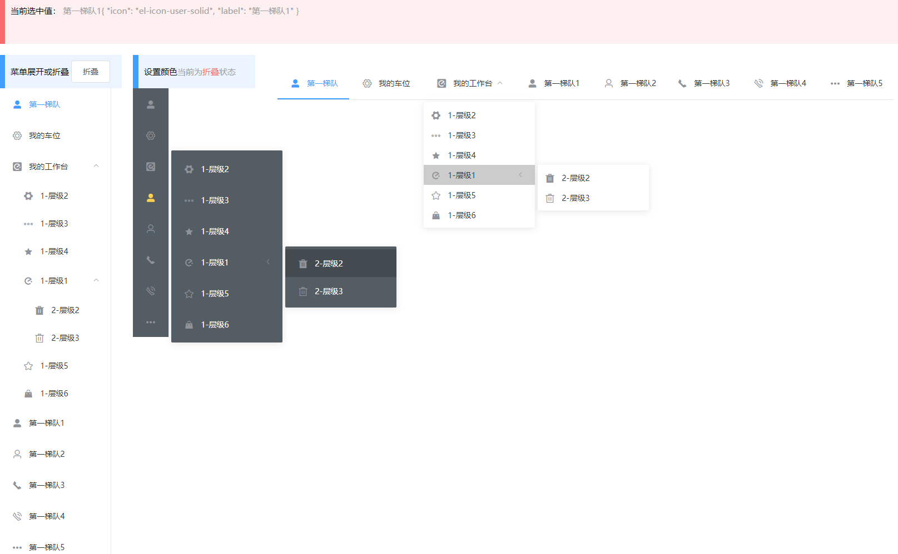
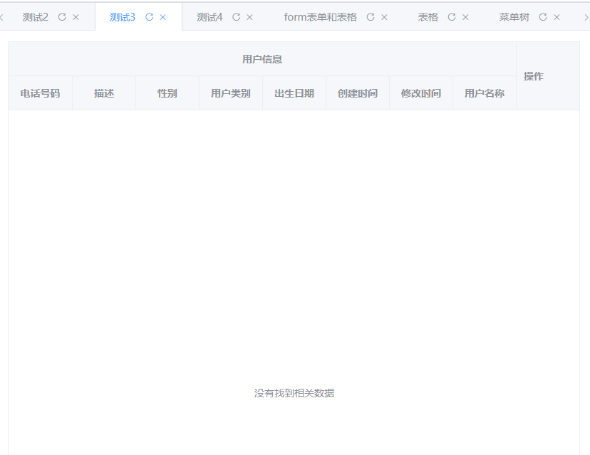

# layout-dynamic

> 基于Element-ui自动生成表单布局，表格布局等

# 注意
> 因目前还处于开发版本，请及时使用`npm update layout-dynamic-ui` 更新到最新版本

# [升级日志](./doc/version.md)
>版本 v1.1.1-beta
> [添加后台管理页组件](./ld-frame.md)
>
> 优化
> - 1.优化[`ld-menu-tree`](./ld-menu-tree.md) 组件
> - 2.优化[`ld-page-tabs`](./ld-page-tabs.md)组件

# 使用方式

## 安装依赖包

  因为是基于Element-ui开发的，所以需要在使用之前安装Element-ui;之后安装本项目`layout-dynamic-ui`
  > npm i element-ui -S
  >
  > npm i layout-dynamic-ui

 在main.js中，使用如下js引入依赖

```javascript
import Vue from 'vue'
import App from './App'

import ElementUI from 'element-ui';
import 'element-ui/lib/theme-chalk/index.css';

import layoutDynamicUI from 'layout-dynamic-ui';
import 'layout-dynamic-ui/lib/index.css';

Vue.use(ElementUI);

Vue.use(layoutDynamicUI);

Vue.config.productionTip = false


new Vue({
  el: '#app',
  components: { App },
  template: '<App/>'
})
```

# 目的
> 我们期望通过传入简单的数据参数，来控制显示布局，避免同样的重复构建相似的布局。我们甚至可以通过从数据库加载布局信息，来显示不同的表单结构，让开发只需要专注于结构，减少对布局的重复构建。

# Axios 封装
  > axios 进行整套分装，只需要简单的配置即可进行操作。支持全局请求前拦截，请求后装饰。

  [详情点这里](./doc/axios.md)


# Util 常用函数封装
 > 对象用函数进行分装

 [详情点这里](./doc/ld-util.md)

# 插件
## 一.支持插件 (`v1.0.0`)
 ### 1. `id-address` 地址组件，目前支持国内常见地区使用。
 ### 2. `id-icon` 图标组件，当前支持`Element-ui`内置的icon，可以通过`Vue.prototype.$ld.iconList`进行扩展。
 ### 3. `id-image` 图片组件，使用`Element-ui`的文件上传组件，当前只能获取图片相关上传数据，不支持上传到指定服务器（待完善！）。
 ### 4. `id-page-loading` 加载组件,在页面出现之前使用可以获得更高的体验效果。
 ### 5. `id-tags` 标签组件，实现一组标签的添加和删除。
 ### 6. `id-forms` 表单组件 [详情点这里](./doc/ld-forms.md)
 ### 7. `ld-table` 表格显示组件 [详情点这里](./doc/ld-table.md)
 ### 8. `ld-menu-tree` 菜单树 [详情点这里](./doc/ld-menu-tree.md)
 ### 9. `ld-page-tabs` 标签页 [详情点这里](./doc/ld-page-tabs.md)
 ### 10. `ld-frame` 后台管理框架也 [详情点这里](./doc/ld-frame.md)
## 二.表单（`ld-forms`）组件支持21中组件类型，未来会更多


 ### 1. 整体效果图

  


 ### 2. 当前支持的组件类型（`v1.0.0`）

- [`tip`](./doc/ld-forms.md#tip)：文字提示内容；可以在from表单中独居一个form子元素，也可用来说明某一个元素相关信息；
- [`datakey`](./doc/ld-forms.md#datakey)：数据键；只用来在某些特定情况下显示数据；
  > 用来显示表单主键，又不想用户能够直接看到主键值；

- [`slot`](./doc/ld-forms.md#slot)：插槽；通过指定定`prop`值，来自定义表单内容
  > 通过自定义插槽实现个性化内容；

- [`text`](./doc/ld-forms.md#text)：文本数据框；
- [`textarea`](./doc/ld-forms.md#textarea)：文本域；
- [`select`](./doc/ld-forms.md#select)：下拉框；
- [`radio`](./doc/ld-forms.md#radio)：单选组；
  > 通过`isButton`来控制显示类型

- [`checkbox`](./doc/ld-forms.md#checkbox)：复选组；
- [`date`](./doc/ld-forms.md#date)：日期组件；支持`Element-ui`中常见的日期类型
  > 可以通过 `dateType`控制日期类型。
  >
  > 支持`year/month/date/dates/week/datetime/datetimerange/daterange/monthrange`

- [`icon`](./doc/ld-forms.md#icon)：图标组件；使用上文提到的`ld-icon`实现图标选取
- [`tag`](./doc/ld-forms.md#tag)：标签组；使用上文提到的`ld-tag`实现标签设置和录入
- [`address`](./doc/ld-forms.md#address)：地址选择组件；使用上文提到的`id-address`实现标签设置和录入
- [`sysdate`](./doc/ld-forms.md#sysdate)：系统日期；在使用创建日期和修改日期时非常有用；
  > 创建日期会判断数据是否已经存在值，如果不存在则获取当前日期
  >
  > 修改日期会动态更新，保持获取最新的日期。

- [`image`](./doc/ld-forms.md#image)：图片上传组；
- [`number`](./doc/ld-forms.md#number)：计数器；
- [`switch`](./doc/ld-forms.md#switch)：开关；
- [`slider`](./doc/ld-forms.md#slider)：滑块;
- [`rate`](./doc/ld-forms.md#rate)：评分；
- [`color`](./doc/ld-forms.md#color)：颜色选择器；
- [`transfer`](./doc/ld-forms.md#transfer)：穿梭框；
- [`param`](./doc/ld-forms.md#param)：参数；

 ### 3.使用示例

 > 在HelloWordd.vue页面写入如下内容（这里只演示`ld-forms`组件的使用）

 ```javascript
 <template>
   <div id="app" class="h-vh">
     <ld-page-loading :loading="loading" class="box-b b-i1">
       <div class="w h f-c over-a-y p10  box-b a-i-c">
         <el-card class="w b-f p10" style="width:350px;height: auto;padding: 80px 40px;">
           <ld-forms ref="loginForm" :cols="1" :form="forms" :layout="layouts">
             <template v-slot:buttons="e">
               <div class="w f-b">
                 <el-button type="primary" style="flex-grow: 2;" :loading="loginLoading" @click="loginData">登陆
                 </el-button>
                 <el-button @click="resetData">重置</el-button>
               </div>
             </template>
           </ld-forms>
         </el-card>
       </div>
     </ld-page-loading>
   </div>
 </template>

 <script>
   export default {
     name: 'App',
     data() {
       return {
         loginLoading: false,
         loading: false,
         forms: {},
         layouts: [{
             prop: 'phone',
             type: 'text',
             label: '',
             placeholder: '请输入电话号码',
             regex: /^[1][0-9]{10}$/,
             require:true,
           },
           {
             prop: 'password',
             type: 'text',
             label: '',
             placeholder: '请输入用户密码',
             regex: /^[1][0-9]{10}$/,
             require:true,
           },
         ]
       }
     },
     methods: {
       loginData() {
         console.log('login')

         //验证数据
         let result=this.$refs.loginForm.checkForm();
         if(result['error']){
           this.$message.error(result['msg'])
           return;
         }

         this.loginLoading = true;
         //模拟请求耗时
         setTimeout(() => {
           this.loginLoading = false;
         }, 2000);


       },
       resetData() {
         this.forms = {};
       }
     },
     created() {
       setTimeout(() => {
         this.loading = false;
       }, 1000);
     }
   }
 </script>


   ```

 效果如下
 - 非空时

 

 - 数据校验不合法时

 

 - 数据校验通过时

 

详细使用说明请阅读[ld-forms详细使用说明](./doc/ld-forms.md)
## 三.表格组件
>  [详情点这里](./doc/ld-table.md)

- 效果图

;

## 四.菜单树,支持多层结构

>  [详情点这里](./doc/ld-menu-tree.md)
>
>  [详细代码参考](./src/pages/menuTree.vue)
>
- 效果图


## 五.标签页

>  [详情点这里](./doc/ld-page-tabs.md)
>
>  [详细代码参考](./src/pages/pageTabs.vue)
>
- 效果图



## 六.后台管理框架页

>  [详情点这里](./doc/ld-frame.md)
>
>  [详细代码参考](./src/pages/home.vue)
>
- 效果图


# CSS 封装

>  [详情点这里](./doc/css.md)
>
> 详细代码参考: [base.css](./src/lib/static/css/base.css)  [basic.css](./src/lib/static/css/basic.css)
>


