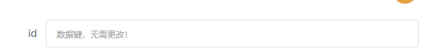
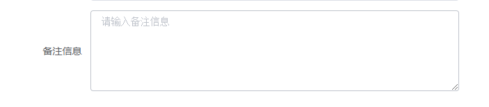
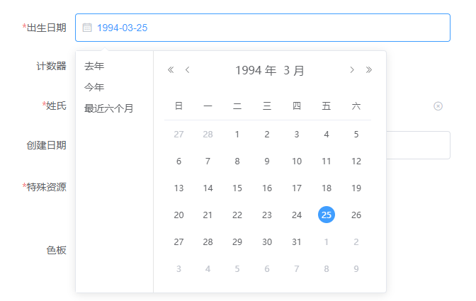
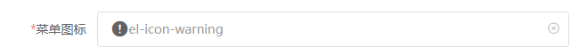
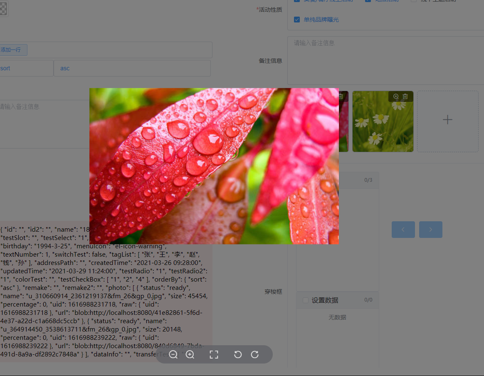
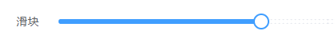

# layout-dynamic

> Generate layout based on parameters

## Build Setup

``` bash
# install dependencies
npm install

# serve with hot reload at localhost:8080
npm run dev

# build for production with minification
npm run build

# build for production and view the bundle analyzer report
npm run build --report
```
# 目的
> 我们期望通过传入简单的数据参数，来控制显示布局，避免同样的重复构建相似的布局。我们甚至可以通过从数据库加载布局信息，来显示不同的表单结构，让开发只需要专注于结构，减少对布局的重复构建。

# Axios 封装
  > axios 进行整套分装，只需要简单的配置即可进行操作。支持全局请求前拦截，请求后装饰。

## 1.设置请求连接服务地址

- 开发环境和生产环境使用不同的地址

```javascript
//设置开发地址
this.$ld.requestSetting.serverPath.development.set('http://127.0.0.1:18085/frame/');
//设置生产地址
this.$ld.requestSetting.serverPath.production.set('http://127.0.0.1:8085/frame/');
```
> 请求地址分为 开发地址和生产地址。当使用 `npm run dev`时，所使用的是开发地址。当使用`npm run build`打包vue项目后，则使用的是生产地址


- 开发环境和生产环境使用同一个地址

```javascript
//会根据当前vue运行环境，进行动态设置地址
this.$ld.requestSetting.serverPath.set('http://127.0.0.1:18085/frame/');
```
> 会根据当前vue运行环境，进行动态设置地址

## 2.设置axios请求头等相关信息
- 设置axios请求等相关信息，需要我们重写`this.$ld.requestSetting.init`方法。

```javascript
 this.$ld.requestSetting.init= (axios) => {
    alert('设置axios信息！');
    return axios;
  }
```
> 重写方法是会获取到一个`axios`对象，需要对axios对象进行操作加工，之后需要返回加工后的`axios`

## 3.请求前拦截和请求后数据装饰
- 请求前拦截和请求后数据装饰需要我们重写`this.$ld.requestSetting.intercept`对象

- - 普通使用

```javascript
 //重写请求拦截器
this.$ld.requestSetting.interceptor = {
  /**
   * 请求前拦截
   */
  before: (event) => {
    //返回 true 和false ,控制是否继续执行请求方法
    return true;
  },
  /**
   * 请求后拦截装饰
   */
  after: (event) => {
     //对查询到的数据，进行统一装饰。
     return event.data;
  }
}

```
- - 使用Promise对象控制

> 在少数情况下，我们可能会通过与用户互动后，确定是否需要继续执行请求，这时使用 Promise 无疑是最好的方式。

```javascript
 //重写请求拦截器
this.$ld.requestSetting.interceptor = {
  /**
   * 请求前拦截
   */
  before: (event) => {
   /**
    * 这里使用 Promise.resolve 返回结果，结果为 true或false
    * 如： Promise.resolve(true);  //继续执行请求方法
    *      Promise.resolve(false); //不在执行请求方法
    */

    return this.$confirm('确定保存数据吗?', '提示', {
      confirmButtonText: '确定',
      cancelButtonText: '取消',
      type: 'warning'
    }).then(() => {
      //使用 true 和false ,控制是否继续执行请求方法
      return Promise.resolve(true);
    }).catch(() => {
      this.$message.info("用户取消了操作！");
      //使用 true 和false ,控制是否继续执行请求方法
      return Promise.resolve(false);
    });
  },
  /**
   * 请求后拦截装饰
   */
  after: (event) => {
    /**
     * 这里使用 Promise.resolve 返回结果，结果为装饰后的数据
     * 如： Promise.resolve(event);  //为程序返回最终装饰后的数据
     */
    return Promise.resolve(event);
  }
}

```

## 4.请求获取数据方法。返回类型：`Promise`

- 请求获取数据使用`this.$ld.request`方法获取数据

- - 支持 多种请求类型

```javascript
 this.$ld.request('test/getUserInfo', 'get',{}).then(res => {
    //获取到数据
  }, interceptError => {
    //当请求被拦截是
    console.log(interceptError);
  })
```

- `request`入参参数

|顺序|名称|类型|必填|默认|说明|示例|
|-|-|-|-|-|-|-|
|1|router|String|√|-|请求路径|'test/getUserInfo'|
|2|methodType|String||get|请求方法：get`\|`post|'get'|
|3|data|Object`\|`Array||{}|请求参数|`{userName:'188888888',password:'1111111'}`|
|4|timeout|Number||60000|超时时间(毫秒);如需全局设置需要调用`this.$ld.requestSetting.config.timeout = 2000;`|1000*2|


 > 除此之外对常用的两种请求类型(get;post)提供了额外的使用方式

 - - get 请求


 ```javascript
  this.$ld.getRequest('test/getUserInfo',{}).then(res => {
     //获取到数据
   }, interceptError => {
     //当请求被拦截是
     console.log(interceptError);
   })
 ```

 - - post 请求

```javascript
 this.$ld.postRequest('test/getUserInfo',{}).then(res => {
    //获取到数据
  }, interceptError => {
    //当请求被拦截是
    console.log(interceptError);
  })
```

- `getRequest`和`postRequest`入参参数

|顺序|名称|类型|必填|默认|说明|示例|
|-|-|-|-|-|-|-|
|1|router|String|√|-|请求路径|'test/getUserInfo'|
|2|data|Object`\|`Array||{}|请求参数|`{userName:'188888888',password:'1111111'}`|
|3|timeout|Number||60000|超时时间(毫秒);如需全局设置需要调用`this.$ld.requestSetting.config.timeout = 2000;`|1000*2|


# 插件
## 一.支持插件 (`v1.0.0`)
 ### 1. `id-address` 地址组件，目前支持国内常见地区使用。
 ### 2. `id-icon` 图标组件，当前支持`Element-ui`内置的icon，可以通过`Vue.prototype.$ld.iconList`进行扩展。
 ### 3. `id-image` 图片组件，使用`Element-ui`的文件上传组件，当前只能获取图片相关上传数据，不支持上传到指定服务器（待完善！）。
 ### 4. `id-page-loading` 加载组件,在页面出现之前使用可以获得更高的体验效果。
 ### 5. `id-tags` 标签组件，实现一组标签的添加和删除。
 ### 6. `id-forms` 表单组件
## 二.表单（`ld-forms`）组件支持21中组件类型，未来会更多
 ### 1. 整体效果图

  

 ### 2. 当前支持的组件类型（`v1.0.0`）

- [`tip`](./ld-forms.md#tip)：文字提示内容；可以在from表单中独居一个form子元素，也可用来说明某一个元素相关信息；


  

- `datakey`：数据键；只用来在某些特定情况下显示数据；

  

  > 用来显示表单主键，又不想用户能够直接看到主键值；

- `slot`：插槽；通过指定定`prop`值，来自定义表单内容

  

  > 通过自定义插槽实现个性化内容；

- `text`：文本数据框；

  

- `textarea`：文本域；

  

- `select`：下拉框；

  

- `radio`：单选组；

  

  > 通过`isButton`来控制显示类型

- `checkbox`：复选组；

  

- `date`：日期组件；支持`Element-ui`中常见的日期类型

  

  > 可以通过 `dateType`控制日期类型。
  >
  > 支持`year/month/date/dates/week/datetime/datetimerange/daterange/monthrange`

- `icon`：图标组件；使用上文提到的`ld-icon`实现图标选取

  

  

- `tag`：标签组；使用上文提到的`ld-tag`实现标签设置和录入

  

- `address`：地址选择组件；使用上文提到的`id-address`实现标签设置和录入

  

  

- `sysdate`：系统日期；在使用创建日期和修改日期时非常有用；

  

  > 创建日期会判断数据是否已经存在值，如果不存在则获取当前日期
  >
  > 修改日期会动态更新，保持获取最新的日期。

- `image`：图片上传组；

  

  

- `number`：计数器；

  

- `switch`：开关；

  

- `slider`：滑块;

  

- `rate`：评分；

  

- `color`：颜色选择器；

  

- `transfer`：穿梭框；

  

- `param`：参数；

  

3.详细使用说明
详细使用说明请阅读[ld-forms详细使用说明](./ld-forms.md)
