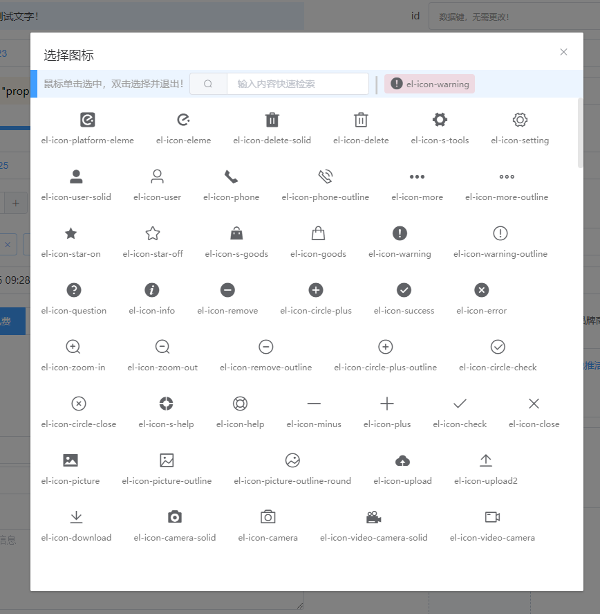
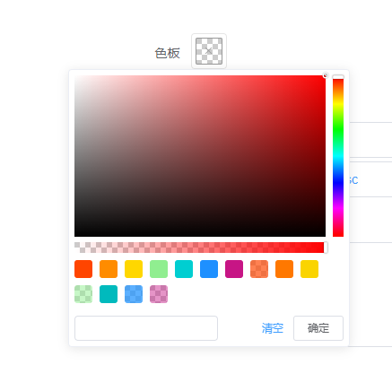

# layout-dynamic

> Generate layout based on parameters

## Build Setup

``` bash
# install dependencies
npm install

# serve with hot reload at localhost:8080
npm run dev

# build for production with minification
npm run build

# build for production and view the bundle analyzer report
npm run build --report
```
# 目的
> 我们期望通过传入简单的数据参数，来控制显示布局，避免同样的重复构建相似的布局。我们甚至可以通过从数据库加载布局信息，来显示不同的表单结构，让开发只需要专注于结构，减少对布局的重复构建。
# 插件
## 一.支持插件 (`v1.0.0`)
### 1. `id-address` 地址组件，目前支持国内常见地区使用。
### 2. `id-icon` 图标组件，当前支持`Element-ui`内置的icon，可以通过`Vue.prototype.$ld.iconList`进行扩展。
### 3. `id-image` 图片组件，使用`Element-ui`的文件上传组件，当前只能获取图片相关上传数据，不支持上传到指定服务器（待完善！）。
### 4. `id-page-loading` 加载组件,在页面出现之前使用可以获得更高的体验效果。
### 5. `id-tags` 标签组件，实现一组标签的添加和删除。
### 6. `id-forms` 表单组件
## 二.表单（`ld-forms`）组件支持21中组件类型，未来会更多
1. 整体效果图

  

2. 当前支持的组件类型（`v1.0.0`）

- `tip`：文字提示内容；可以在from表单中独居一个form子元素，也可用来说明某一个元素相关信息；


  

- `datakey`：数据键；只用来在某些特定情况下显示数据；

  

  > 用来显示表单主键，又不想用户能够直接看到主键值；

- `slot`：插槽；通过指定定`prop`值，来自定义表单内容

  

  > 通过自定义插槽实现个性化内容；

- `text`：文本数据框；

  

- `textarea`：文本域；

  

- `select`：下拉框；

  

- `radio`：单选组；

  

  > 通过`isButton`来控制显示类型

- `checkbox`：复选组；

  

- `date`：日期组件；支持`Element-ui`中常见的日期类型

  

  > 可以通过 `dateType`控制日期类型。
  >
  > 支持`year/month/date/dates/week/datetime/datetimerange/daterange/monthrange`

- `icon`：图标组件；使用上文提到的`ld-icon`实现图标选取

  

  

- `tag`：标签组；使用上文提到的`ld-tag`实现标签设置和录入

  

- `address`：地址选择组件；使用上文提到的`id-address`实现标签设置和录入

  

  

- `sysdate`：系统日期；在使用创建日期和修改日期时非常有用；

  

  > 创建日期会判断数据是否已经存在值，如果不存在则获取当前日期
  >
  > 修改日期会动态更新，保持获取最新的日期。

- `image`：图片上传组；

  

  

- `number`：计数器；

  

- `switch`：开关；

  

- `slider`：滑块;

  

- `rate`：评分；

  

- `color`：颜色选择器；

  

- `transfer`：穿梭框；

  

- `param`：参数；

  

3.详细使用说明
详细使用说明请阅读[ld-forms详细使用说明](./ld-forms.md)
