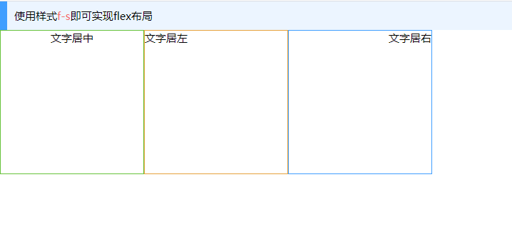

# 目的
> 在使用中通常会遇到，许多样式需要重新封装,反复的使用频率较高的样式进行单独的封装，在使用时只需要使用class=""即可调用

# 示例
```html
<div>
  <div class="tip-p b-p1">使用样式<span class="c-d">f-s</span>即可实现flex布局</div>
  <div class="f-s">
    <div class="w-200 h-200 bor-s t-c">文字居中</div>
    <div class="w-200 h-200 bor-w t-l">文字居左</div>
    <div class="w-200 h-200 bor-p t-r">文字居右</div>
  </div>
</div>

```

如上代码会实现如下效果

)

>更多类样式参考下表

# 基本样式封装说明 (以下样式都为简写模式；[全写参考点这里](../src/lib/static/css/base.css))

|类名称|所属类别|说明|原型|透明度派生样式|
|-|-|-|-|-| 
|b-f|背景色|白色|`background-color: rgba(255, 255, 255, 1) !important;`|透明度1-0.1 ,依次为： `b-f` `b-f9` `b-f8` `b-f7` `b-f6` `b-f5` `b-f4` `b-f3` `b-f2` `b-f1`|
|b-b|背景色|黑色|`background-color: rgba(0, 0, 0, 1) !important;`|透明度1-0.1 ,依次为： `b-b` `b-b9` `b-b8` `b-b7` `b-b6` `b-b5` `b-b4` `b-b3` `b-b2` `b-b1`|
|b-p|背景色|基本颜色|`background-color: var(--primarycolor) !important;`|透明度1-0.1 ,依次为： `b-p` `b-p9` `b-p8` `b-p7` `b-p6` `b-p5` `b-p4` `b-p3` `b-p2` `b-p1`|
|b-s|背景色|成功颜色|`background-color: var(--successcolor) !important;`|透明度1-0.1 ,依次为： `b-s` `b-s9` `b-s8` `b-s7` `b-s6` `b-s5` `b-s4` `b-s3` `b-s2` `b-s1`|
|b-w|背景色|警告颜色|`background-color: var(--warningcolor) !important;`|透明度1-0.1 ,依次为： `b-w` `b-w9` `b-w8` `b-w7` `b-w6` `b-w5` `b-w4` `b-w3` `b-w2` `b-w1`|
|b-d|背景色|危险颜色|`background-color: var(--dangercolor) !important;`|透明度1-0.1 ,依次为： `b-d` `b-d9` `b-d8` `b-d7` `b-d6` `b-d5` `b-d4` `b-d3` `b-d2` `b-d1`|
|b-i|背景色|信息颜色|`background-color: var(--infocolor) !important;`|透明度1-0.1 ,依次为： `b-i` `b-i9` `b-i8` `b-i7` `b-i6` `b-i5` `b-i4` `b-i3` `b-i2` `b-i1`|
|b-h-f|访问背景色|白色|`background-color: #FFFFFF !important;`||
|b-h-b|访问背景色|黑色|`background-color: #000000 !important;`||
|b-h-p|访问背景色|基本颜色|`background-color: var(--primarycolor) !important;`||
|b-h-s|访问背景色|成功颜色|`background-color: var(--successcolor) !important;`||
|b-h-w|访问背景色|警告颜色|`background-color: var(--warningcolor) !important;`||
|b-h-d|访问背景色|危险颜色|`background-color: var(--dangercolor) !important;`||
|b-h-i|访问背景色|信息颜色|`background-color: var(--infocolor) !important;`||
|b-h-e9\|b-h-ef|访问背景色|浅灰色 #e9e9eb|`background-color: #e9e9eb !important;`||
|c-f|文字颜色|白色|`color: #FFFFFF;`||
|c-b|文字颜色|黑色|`color: #000000;`||
|c-t|文字颜色|透明色|`color: var(--transparent) !important;`||
|c-p|文字颜色|基本颜色|`color: var(--primarycolor)!important;`||
|c-s|文字颜色|成功颜色|`color: var(--successcolor)!important;`||
|c-w|文字颜色|警告颜色|`color: var(--warningcolor)!important;`||
|c-d|文字颜色|危险颜色|`color: var(--dangercolor)!important;`||
|c-i|文字颜色|信息颜色|`color: var(--infocolor)!important;`||
|t-l|文字位置|居左|`text-align: left !important;`| |
|t-r|文字位置|居右|`text-align: right !important;`| |
|t-c|文字位置|居中|`text-align: center !important;`| |
|c-h-f|访问文字颜色|白色|`color: #FFFFFF;`||
|c-h-b|访问文字颜色|黑色|`color: #000000;`||
|c-h-t|访问文字颜色|透明色|`color: var(--transparent) !important;`||
|c-h-p|访问文字颜色|基本颜色|`color: var(--primarycolor)!important;`||
|c-h-s|访问文字颜色|成功颜色|`color: var(--successcolor)!important;`||
|c-h-w|访问文字颜色|警告颜色|`color: var(--warningcolor)!important;`||
|c-h-d|访问文字颜色|危险颜色|`color: var(--dangercolor)!important;`||
|c-h-i|访问文字颜色|信息颜色|`color: var(--infocolor)!important;`||
|c|文字颜色|由黑到白|`color: rgb(0, 0, 0);`|文字颜色，`c`表示黑色，`c13`表示变色；由黑到白依次是：`c` `c1` `c2` `c3` `c4` `c5` `c6` `c7` `c8` `c9` `c10` `c11` `c12` `c13`|
|p|内边距|`padding`|`padding: var(--x20)`|内边距，由小及大依次是：，`p` `p1` `p2` `p3` `p4` `p5` `p6` `p7` `p8` `p9` `p10`；`p0`padding为0；`p10`的`p`的padding相同|
|p-h|内边距访问颜色|`padding:hover`|`padding: var(--x20)`|内边距访问值，由小及大依次是：，`p-h` `p-h1` `p-h2` `p-h3` `p-h4` `p-h5` `p-h6` `p-h7` `p-h8` `p-h9` `p-h10`；`p-h0`padding为0；`p-h10`的`p-h`的padding相同|
|p-t|内边距|上内边距`padding-top`|`padding-top: var(--x20)`|上内边距，由小及大依次是：，`p-t` `p-t1` `p-t2` `p-t3` `p-t4` `p-t5` `p-t6` `p-t7` `p-t8` `p-t9` `p-t10`；`p-t0`padding为0；`p-t10`的`p-t`的padding相同|
|p-r|内边距|右内边距`padding-right`|`padding-right: var(--x20)`|右内边距，由小及大依次是：，`p-r` `p-r1` `p-r2` `p-r3` `p-r4` `p-r5` `p-r6` `p-r7` `p-r8` `p-r9` `p-r10`；`p-r0`padding为0；`p-r10`的`p-r`的padding相同|
|p-b|内边距|下内边距`padding-bottom`|`padding-bottom: var(--x20)`|右内边距，由小及大依次是：，`p-b` `p-b1` `p-b2` `p-b3` `p-b4` `p-b5` `p-b6` `p-b7` `p-b8` `p-b9` `p-b10`；`p-b0`padding为0；`p-b10`的`p-b`的padding相同|
|p-l|内边距|左内边距`padding-left`|`padding-left: var(--x20)`|左内边距，由小及大依次是：，`p-l` `p-l1` `p-l2` `p-l3` `p-l4` `p-l5` `p-l6` `p-l7` `p-l8` `p-l9` `p-l10`；`p-l0`padding为0；`p-l10`的`p-l`的padding相同|
|p-tr0|2个内边距为`0`|上右内边距为零|`padding-top: 0;padding-right: 0;`||
|p-tl0|2个内边距为`0`|上左内边距为零|`padding-top: 0;padding-left: 0;`||
|p-tb0|2个内边距为`0`|上下内边距为零|`padding-top: 0;padding-bottom: 0;`||
|p-lr0|2个内边距为`0`|左右内边距为零|`padding-left: 0;padding-right: 0;`||
|p-lb0|2个内边距为`0`|左下内边距为零|`padding-left: 0;padding-bottom: 0;`||
|p-br0|2个内边距为`0`|下右内边距为零|`padding-bottom: 0;padding-right: 0;`||
|p-tbl0|3个内边距为`0`|上下左内边距为零|`padding-top: 0;padding-bottom: 0;padding-left: 0;`||
|p-tbr0|3个内边距为`0`|上下右内边距为零|`padding-left: 0;padding-right: 0;padding-right: 0;`||
|p-lrt0|3个内边距为`0`|左右上内边距为零|`padding-left:0;padding-right: 0;padding-top: 0;`||
|p-lrb0|3个内边距为`0`|左右下内边距为零|`padding-left: 0;padding-right: 0;padding-bottom: 0`||
|m|外边距|`margin`|`margin: var(--x20)`|外边距，由小及大依次是：，`m` `m1` `m2` `m3` `m4` `m5` `m6` `m7` `m8` `m9` `m10`；`m0`margin为0；`m10`的`m`的margin相同|
|m-t|外边距|上外边距`margin-top`|`margin-top: var(--x20)`|上外边距，由小及大依次是：，`m-t` `m-t1` `m-t2` `m-t3` `m-t4` `m-t5` `m-t6` `m-t7` `m-t8` `m-t9` `m-t10`；`m-t0`margin为0；`m-t10`的`m-t`的margin相同|
|m-r|外边距|右外边距`margin-right`|`margin-right: var(--x20)`|右外边距，由小及大依次是：，`m-r` `m-r1` `m-r2` `m-r3` `m-r4` `m-r5` `m-r6` `m-r7` `m-r8` `m-r9` `m-r10`；`m-r0`margin为0；`m-r10`的`m-r`的margin相同|
|m-b|外边距|下外边距`margin-bottom`|`margin-bottom: var(--x20)`|右外边距，由小及大依次是：，`m-b` `m-b1` `m-b2` `m-b3` `m-b4` `m-b5` `m-b6` `m-b7` `m-b8` `m-b9` `m-b10`；`m-b0`margin为0；`m-b10`的`m-b`的margin相同|
|m-l|外边距|左外边距`margin-left`|`margin-left: var(--x20)`|左外边距，由小及大依次是：，`m-l` `m-l1` `m-l2` `m-l3` `m-l4` `m-l5` `m-l6` `m-l7` `m-l8` `m-l9` `m-l10`；`m-l0`margin为0；`m-l10`的`m-l`的margin相同|
|m-tr0|2个外边距为`0`|上右外边距为零|`margin-top: 0;margin-right: 0;`||
|m-tl0|2个外边距为`0`|上左外边距为零|`margin-top: 0;margin-left: 0;`||
|m-tb0|2个外边距为`0`|上下外边距为零|`margin-top: 0;margin-bottom: 0;`||
|m-lr0|2个外边距为`0`|左右外边距为零|`margin-left: 0;margin-right: 0;`||
|m-lb0|2个外边距为`0`|左下外边距为零|`margin-left: 0;margin-bottom: 0;`||
|m-br0|2个外边距为`0`|下右外边距为零|`margin-bottom: 0;margin-right: 0;`||
|m-tbl0|3个外边距为`0`|上下左外边距为零|`margin-top: 0;margin-bottom: 0;margin-left: 0;`||
|m-tbr0|3个外边距为`0`|上下右外边距为零|`margin-left: 0;margin-right: 0;margin-right: 0;`||
|m-lrt0|3个外边距为`0`|左右上外边距为零|`margin-left:0;margin-right: 0;margin-top: 0;`||
|m-lrb0|3个外边距为`0`|左右下外边距为零|`margin-left: 0;margin-right: 0;margin-bottom: 0`||
|bor-ef|边框颜色|#efefef |`border: var(--x1) solid #efefef !important`| |
|bor-ff|边框颜色| #ffffff |`	border: var(--x1) solid #ffffff !important;`| |
|bor-p|边框颜色| 主要色 |`border: var(--x1) solid  var(--primarycolor)  !important;`| |
|bor-s|边框颜色| 成功色 |`border: var(--x1) solid  var(--successcolor)  !important;`| |
|bor-w|边框颜色| 警告色 |`border: var(--x1) solid  var(--warningcolor)  !important;`| |
|bor-d|边框颜色| 危险色 |`border: var(--x1) solid  var(--dangercolor)  !important;`| |
|bor-i|边框颜色| 信息色 |`border: var(--x1) solid  var(--infocolor)  !important;`| |
|bor-blt0|3个边框为`0`|上下右边框为零|`border-left: 0 !important; border-right: 0 !important; border-right: 0 !important;`||
|bor-trb0|3个边框为`0`|上下右边框为零|`border-top: 0 !important; border-bottom: 0 !important; border-left: 0 !important;`||
|bor-ltr0|3个边框为`0`|左右上边框为零|`border-left: 0 !important; border-right: 0 !important; border-top: 0 !important;`||
|bor-rbl0|3个边框为`0`|左右下边框为零|`border-left: 0 !important; border-right: 0 !important; border-bottom: 0 !important;`||
|bor-0|常用边框值|上右下左边框都为固定值|`border-top-width: 0 !important; border-left: 0 !important; border-right: 0 !important; border-bottom: 0 !important;`|常用的依次为:`bor-0` `bor-1` `bor-2` `bor-3` `bor-4` `bor-5`|
|bor-t0|常用边框值|上边框为固定值，其他边框为零|`border:0;border-top-width: 0 !important;`|常用的依次为:`bor-t0` `bor-t1` `bor-t2` `bor-t3` `bor-t4` `bor-t5`|
|bor-r0|常用边框值|右边框为固定值，其他边框为零|`border:0;border-right-width: 0 !important;`|常用的依次为:`bor-r0` `bor-r1` `bor-r2` `bor-r3` `bor-r4` `bor-r5`|
|bor-b0|常用边框值|下边框为固定值，其他边框为零|`border:0;border-bottom-width: 0 !important;`|常用的依次为:`bor-b0` `bor-b1` `bor-b2` `bor-b3` `bor-b4` `bor-b5`|
|bor-l0|常用边框值|左边框为固定值，其他边框为零|`border:0;border-left-width: 0 !important;`|常用的依次为:`bor-l0` `bor-l1` `bor-l2` `bor-l3` `bor-r4` `bor-l5`|
|r|圆角|`border-radius`|`border-radius: 50%;`|圆角值，从小到大依次为：，`r0` `r1` `r2` `r3` `r4` `r5` `r6` `r7` `r8` `r9` `r10`；`r0`border-radius为0；`r10`的border-radius`border-radius: var(--x20);`|
|w|宽度百分比|`width`|`width: 100%;`|宽度百分比：，`w0` `w1` `w2` `w3` `w4` `w5` `w6` `w7` `w8` `w9` `w`；`w0`width为0；`w`的width为100%`|
|h|高度百分比|`height`|`height: 100%;`|高度百分比：，`h0` `h1` `h2` `h3` `h4` `h5` `h6` `h7` `h8` `h9` `h`；`h0`height为0；`h`的height为100%`|
|w-vw|视窗宽度百分比|`width`|`width: 100vw!important;`|宽度百分比：，`w-vw0` `w-vw1` `w-vw2` `w-vw3` `w-vw4` `w-vw5` `w-vw6` `w-vw7` `w-vw8` `w-vw9` `w-vw`；`w-vw0`width为0；`w-vw`的width为100vw`|
|h-vh|视窗高度百分比|`height`|`height: 100vh!important;`|高度百分比：，`h-vh0` `h-vh1` `h-vh2` `h-vh3` `h-vh4` `h-vh5` `h-vh6` `h-vh7` `h-vh8` `h-vh9` `h-vh`；`h-vh0`height为0；`h-vh`的height为100vh`|
|w-10|常用宽度|`width`|`width: var(--x10);`|常用宽度：，`w-10` `w-20` `w-40` `w-50` `w-60` `w-80` `w-100` `w-120` `w-140` `w-160` `w-180` `w-200` `w-220` `w-240` `w-260` `w-280` `w-300`|
|h-10|常用高度|`height`|`height:var(--x10);`|常用高度：，`h-10` `h-20` `h-40` `h-50` `h-60` `h-80` `h-100` `h-120` `h-140` `h-160` `h-180` `h-200` `h-220` `h-240` `h-260` `h-280` `h-300`|
|l-h10|常用行高|`line-height`|`line-height: var(--x10)`|常用行高：，`l-h10` `l-h20` `l-h40` `l-h60` `l-h80` `l-h100` `l-h120` `l-h140` `l-h160` `l-h180` `l-h200` `l-h220` `l-h240` `l-h260` `l-h280` `l-h300`|
|els|文字超出使用省略号|`text-overflow`|`text-overflow:ellipsis;overflow: hidden;white-space: nowrap;`|文字超出使用省略号。从1行到9行，依次为： `els1` `els2` `els3` `els4` `els5` `els6` `els7` `els8` `els9` |
|f-s|flex布局|从行首起始位置开始排列|`display: flex!important;justify-content: flex-start;`|其他布局为：`f-s`(从行首起始位置开始排列),`f-e`(从行尾位置开始排列),`f-c`(居中排列),`f-b`(均匀排列每个元素；首个元素放置于起点，末尾元素放置于终点)|
|f-s-w|flex布局|从行首起始位置开始排列,当排满一行之后自动换行。|`display: flex!important;justify-content: flex-start;flex-wrap: wrap;`|排满后自动换行其他布局为：`f-s-w`(从行首起始位置开始排列),`f-e-w`(从行尾位置开始排列),`f-c-w`(居中排列),`f-b-w`(均匀排列每个元素；首个元素放置于起点，末尾元素放置于终点)|
|warp|flex布局|拆行|`flex-wrap: wrap;`| |
|nowarp|flex布局|不拆行|`flex-wrap: nowrap;`| |
|f-n-c-w|flex布局|布局子元素，不进行缩放|`flex-grow: 0;flex-shrink: 0;`|必须是flex布局|
|a-i-c|flex布局|布局子元素垂直居中|`display: flex;align-items: center;`	||
|fs|字体|font-size|`font-size: var(--x12);`|其他自动大小依次为：`fs` `fs14` `fs15` `fs16` `fs18` `fs20` `fs22` `fs24` `fs26` `fs28` `fs30` `fs32` `fs26` `fs38` `fs40`  `fs52`|
|tip-p|强调文字样式|主要色|`border-left: var(--x10) solid var(--primarycolor)!important;text-align: left;padding: var(--x10);`|通常情况，使用组合来修饰强调文字，如：class="tip-p b-p1",会为一段文字使用透明度为0.1的主要色作为背景色，使用主要色作为左边框颜色 |
|tip-s|强调文字样式|成功色|`border-left: var(--x10) solid var(--successcolor)!important;text-align: left;padding: var(--x10);`|通常情况，使用组合来修饰强调文字，如：class="tip-s b-s1",会为一段文字使用透明度为0.1的成功色作为背景色，使用成功色作为左边框颜色 |
|tip-w|强调文字样式|警告色|`border-left: var(--x10) solid var(--warningcolor)!important;text-align: left;padding: var(--x10);`|通常情况，使用组合来修饰强调文字，如：class="tip-w b-w1",会为一段文字使用透明度为0.1的警告色作为背景色，使用警告色作为左边框颜色 |
|tip-d|强调文字样式|危险色|`border-left: var(--x10) solid var(--dangercolor)!important;text-align: left;padding: var(--x10);`|通常情况，使用组合来修饰强调文字，如：class="tip-d b-d1",会为一段文字使用透明度为0.1的危险色作为背景色，使用危险色作为左边框颜色 |
|tip-i|强调文字样式|信息色|`border-left: var(--x10) solid var(--infocolor)!important;text-align: left;padding: var(--x10);`|通常情况，使用组合来修饰强调文字，如：class="tip-i b-i1",会为一段文字使用透明度为0.1的信息色作为背景色，使用信息色作为左边框颜色 |
|box-b|计算一个元素的总宽度和总高度|填充和边框将在盒子内`box-sizing`|`box-sizing: border-box;`| |
|box-c|计算一个元素的总宽度和总高度|任何内边距和边框都将在已设定的宽度和高度内进行绘制`box-sizing`|`box-sizing: content-box;`| |
|box|计算一个元素的总宽度和总高度|规定应从父元素继承 box-sizing 属性的值`box-sizing`|`box-sizing: inherit;`| |
|o|透明度|opacity|`opacity: .5`|透明度从0-1依次排列  `o0` `o1` `o2` `o3` `o4` `o5` `o6` `o7` `o8` `o9` `o10`|
|box-shadow|元素阴影|rgba(0, 0, 0, 0.1)|`box-shadow: 0 var(--x4) var(--x12) 0 rgba(0, 0, 0, 0.1);`	||
|box-shadow-hover|访问时元素阴影|rgba(0, 0, 0, 0.1)|`box-shadow: 0 var(--x4) var(--x12) 0 rgba(0, 0, 0, 0.1);`	||
|cur-d|光标样式|默认指针，通常是箭头|`cursor: default;`	||
|cur-p|光标样式|通常为手|`cursor: pointer;`	||

# 附录 (css 全局变量的定义)
```css
:root {
  --primarycolor: rgba(64, 158, 255, 1);
  --primarycolor9: rgba(64, 158, 255, .9);
  --primarycolor8: rgba(64, 158, 255, .8);
  --primarycolor7: rgba(64, 158, 255, .7);
  --primarycolor6: rgba(64, 158, 255, .6);
  --primarycolor5: rgba(64, 158, 255, .5);
  --primarycolor4: rgba(64, 158, 255, .4);
  --primarycolor3: rgba(64, 158, 255, .3);
  --primarycolor2: rgba(64, 158, 255, .2);
  --primarycolor1: rgba(64, 158, 255, .1);

  /**成功颜色 success*/
  --successcolor: rgba(103, 194, 58, 1);
  --successcolor9: rgba(103, 194, 58, .9);
  --successcolor8: rgba(103, 194, 58, .8);
  --successcolor7: rgba(103, 194, 58, .7);
  --successcolor6: rgba(103, 194, 58, .6);
  --successcolor5: rgba(103, 194, 58, .5);
  --successcolor4: rgba(103, 194, 58, .4);
  --successcolor3: rgba(103, 194, 58, .3);
  --successcolor2: rgba(103, 194, 58, .2);
  --successcolor1: rgba(103, 194, 58, .1);

  /**警告颜色 warning */
  --warningcolor: rgba(230, 162, 60, 1);
  --warningcolor9: rgba(230, 162, 60, .9);
  --warningcolor8: rgba(230, 162, 60, .8);
  --warningcolor7: rgba(230, 162, 60, .7);
  --warningcolor6: rgba(230, 162, 60, .6);
  --warningcolor5: rgba(230, 162, 60, .5);
  --warningcolor4: rgba(230, 162, 60, .4);
  --warningcolor3: rgba(230, 162, 60, .3);
  --warningcolor2: rgba(230, 162, 60, .2);
  --warningcolor1: rgba(230, 162, 60, .1);


  /**危险颜色 danger */
  --dangercolor: rgba(245, 108, 108, 1);
  --dangercolor9: rgba(245, 108, 108, .9);
  --dangercolor8: rgba(245, 108, 108, .8);
  --dangercolor7: rgba(245, 108, 108, .7);
  --dangercolor6: rgba(245, 108, 108, .6);
  --dangercolor5: rgba(245, 108, 108, .5);
  --dangercolor4: rgba(245, 108, 108, .4);
  --dangercolor3: rgba(245, 108, 108, .3);
  --dangercolor2: rgba(245, 108, 108, .2);
  --dangercolor1: rgba(245, 108, 108, .1);

  /**信息颜色 info */
  --infocolor: rgba(144, 147, 153, 1);
  --infocolor9: rgba(144, 147, 153, .9);
  --infocolor8: rgba(144, 147, 153, .8);
  --infocolor7: rgba(144, 147, 153, .7);
  --infocolor6: rgba(144, 147, 153, .6);
  --infocolor5: rgba(144, 147, 153, .5);
  --infocolor4: rgba(144, 147, 153, .4);
  --infocolor3: rgba(144, 147, 153, .3);
  --infocolor2: rgba(144, 147, 153, .2);
  --infocolor1: rgba(144, 147, 153, .1);

  /**
 * 透明色
 */
  --transparent: transparent;


  --whitecolor: #fff;
  --blackcolor: #000;
  --color: rgb(0, 0, 0);
  --color1: rgb(20, 20, 20);
  --color2: rgb(40, 40, 40);
  --color3: rgb(60, 70, 70);
  --color4: rgb(80, 80, 80);
  --color5: rgb(100, 100, 100);
  --color6: rgb(120, 120, 120);
  --color7: rgb(140, 140, 140);
  --color8: rgb(160, 160, 160);
  --color9: rgb(180, 180, 180);
  --color10: rgb(200, 200, 200);
  --color11: rgb(220, 220, 220);
  --color12: rgb(240, 240, 240);
  --color13: rgb(255, 255, 255);

  --x: 10px;
  --x1: 1px;
  --x2: 2px;
  --x3: 3px;
  --x4: 4px;
  --x5: 5px;
  --x6: 6px;
  --x8: 8px;
  --x10: 10px;
  --x12: 12px;
  --x14: 14px;
  --x15: 15px;
  --x16: 16px;
  --x18: 18px;
  --x20: 20px;
  --x22: 22px;
  --x24: 24px;
  --x26: 26px;
  --x28: 28px;
  --x30: 30px;
  --x32: 32px;
  --x34: 34px;
  --x36: 36px;
  --x38: 38px;
  --x40: 40px;
  --x42: 42px;
  --x44: 44px;
  --x46: 46px;
  --x48: 48px;
  --x50: 50px;
  --x52: 52px;
  --x54: 54px;
  --x56: 56px;
  --x58: 58px;
  --x60: 60px;
  --x62: 62px;
  --x64: 64px;
  --x66: 66px;
  --x68: 68px;
  --x70: 70px;
  --x72: 72px;
  --x74: 74px;
  --x76: 76px;
  --x78: 78px;
  --x80: 80px;
  --x82: 82px;
  --x84: 84px;
  --x86: 86px;
  --x88: 88px;
  --x90: 90px;
  --x92: 92px;
  --x94: 94px;
  --x96: 96px;
  --x98: 98px;
  --x100: 100px;
  --x102: 102px;
  --x104: 104px;
  --x106: 106px;
  --x108: 108px;
  --x110: 110px;
  --x112: 112px;
  --x114: 114px;
  --x116: 116px;
  --x118: 118px;
  --x120: 120px;
  --x140: 140px;
  --x160: 160px;
  --x180: 180px;
  --x200: 200px;
  --x220: 220px;
  --x240: 240px;
  --x260: 260px;
  --x280: 280px;
  --x300: 300px;
  --x320: 320px;
  --x360: 360px;
  --x400: 400px;
  --x440: 440px;
  --x480: 480px;
  --x520: 520px;
  --x560: 560px;
  --x600: 600px;
}

```
