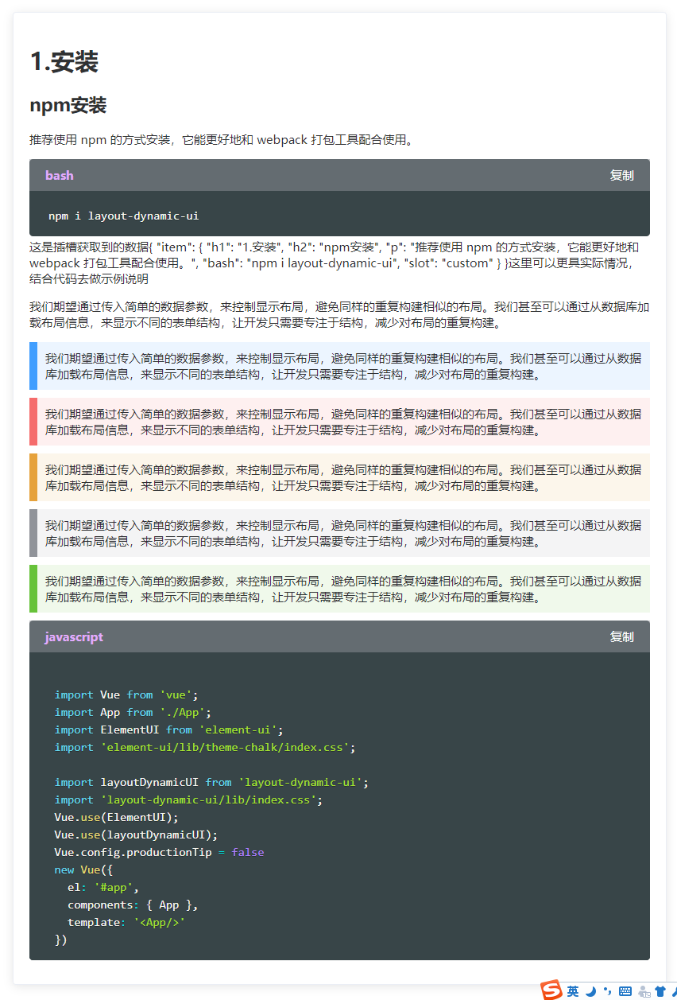

# `ld-doc` 文档编写页面

## 目的

> 在书写web说明示例文档时，通常需要结合代码显示不同的效果，这是，需要一个轻量级，简单的文档模板去结合代码进行显示示例
## 可使用的key
|标签关键字|补充|
|-|-|
|p||
|h1||
|h2||
|h3||
|slot|(具名插槽)|
|tip|tip\|tip_p 主题色，tip_d 危险色，tip_w 警告色 tip_i 信息色 tip_s 成功色|
|html||
|css||
|javascript||
|dart||
|bash||
|shell||
|sql||
## 示例
```html
  <doc :doc="doc">
    <template v-slot:name="e">
      这是插槽获取到的数据<br />
      {{e}}</br>
      这里可以更具实际情况，结合代码去做示例说明
    </template>
  </doc>
```
```javascript
//...
data() {
return {
  doc: [{
    h1: '1.安装',
    h2: 'npm安装',
    p: '推荐使用 npm 的方式安装，它能更好地和 webpack 打包工具配合使用。',
    shell: 'npm i layout-dynamic-ui',
    //插槽 插槽名称
    slot: 'custom',
  }, {
    p: '我们期望通过传入简单的数据参数，来控制显示布局，避免同样的重复构建相似的布局。我们甚至可以通过从数据库加载布局信息，来显示不同的表单结构，让开发只需要专注于结构，减少对布局的重复构建。',
  }, {
    tip: '我们期望通过传入简单的数据参数，来控制显示布局，避免同样的重复构建相似的布局。我们甚至可以通过从数据库加载布局信息，来显示不同的表单结构，让开发只需要专注于结构，减少对布局的重复构建。',
    tip_d: '我们期望通过传入简单的数据参数，来控制显示布局，避免同样的重复构建相似的布局。我们甚至可以通过从数据库加载布局信息，来显示不同的表单结构，让开发只需要专注于结构，减少对布局的重复构建。',
    tip_w: '我们期望通过传入简单的数据参数，来控制显示布局，避免同样的重复构建相似的布局。我们甚至可以通过从数据库加载布局信息，来显示不同的表单结构，让开发只需要专注于结构，减少对布局的重复构建。',
    tip_i: '我们期望通过传入简单的数据参数，来控制显示布局，避免同样的重复构建相似的布局。我们甚至可以通过从数据库加载布局信息，来显示不同的表单结构，让开发只需要专注于结构，减少对布局的重复构建。',
    tip_s: '我们期望通过传入简单的数据参数，来控制显示布局，避免同样的重复构建相似的布局。我们甚至可以通过从数据库加载布局信息，来显示不同的表单结构，让开发只需要专注于结构，减少对布局的重复构建。',
  },
  {
    code:{
      javascript:
        (`
  import import Vue from 'vue'
  import App from './App'
  import ElementUI from 'element-ui';
  import 'element-ui/lib/theme-chalk/index.css';

  import layoutDynamicUI from 'layout-dynamic-ui';
  import 'layout-dynamic-ui/lib/index.css';

  Vue.use(ElementUI);

  Vue.use(layoutDynamicUI);

  Vue.config.productionTip = false


  new Vue({
  el: '#app',
  components: { App },
  template: '<App/>'
  })`)
    }
  }]
}
}
//...

```
> 通过以上代码的简单示例，即可获取到下方的效果图

## 效果图

  

## `ld-doc` 参数

> `ld-doc` 只有简单几个参数

|关键字|类型|解释|默认值|是否必须|说明|
|-|-|-|-|-|-|
|doc|[String,Array,Object]|要解析的文档类型||√||


## Slot 插槽（作用域插槽）
|插槽方式|类型|插槽入参|说明|
|-|-|-|-|
|自定名称|作用域插槽||根据传入的数据值定义不同的插槽|
