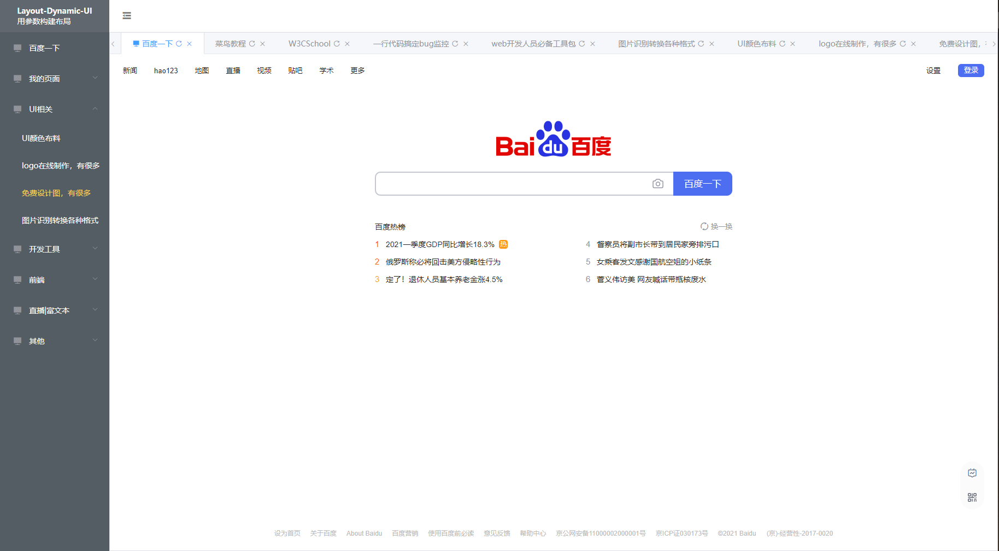

# `ld-frame`后台管理软件

## 效果图

  

## `ld-frame` 参数

> `ld-page-tabs` 只有简单的两个参数

|关键字|类型|解释|默认值|是否必须|说明|
|-|-|-|-|-|-|
|menuTreeUniqueOpened|Boolean|菜单树是否只打开一个|||菜单树是否只打开一个|
|menuTree|Array|菜单树参数|||详情参考[菜单树参数](./ld-menu-tree.md##`ld-menu-tree`属性)|
|leftHeadInfo|Object||头部左侧信息||{image:'logo图片',label:'右侧第一行文字',text:'右侧第二行文字'}||

## Event 事件
 > 无

## Slot 插槽（作用域插槽）
|名称|类型|插槽入参|说明|
|-|-|-|-|
|headCenter|默认插槽||头部内容插槽|
|logo|作用域插槽||自定义左侧图标和文字|
|page|作用域插槽|item {} 一个tab元素对象值|使用此插槽意味着你需要自己完成页面相关的显示和操作|
