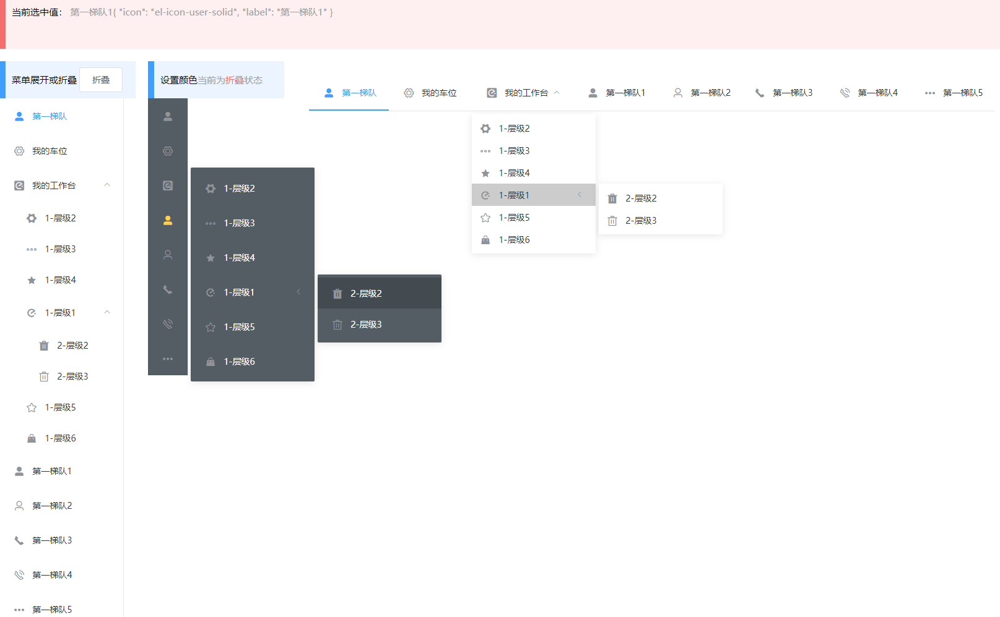

# `ld-menu-tree` 菜单树组件
> 通过简单的参数配置，即可快捷的使用菜单数据

# 效果图

## `ld-menu-tree` 属性

|关键字|类型|解释|默认值|是否必须|说明|
|-|-|-|-|-|-|
|tree|Array|菜单参数|[]|√|一组对象数据的集合[{label:'菜单1'},{label:'菜单2'},{label:'菜单3'}]即可创建一个简单的菜单[详情点这里,查看tree的取值](###tree)|
|mode|String|菜单类型(`vertical`\|`horizontal`)|vertical纵向||菜单树方向，可以使纵向，也可以是横向菜单|
|collapse|Boolean|是否水平折叠|false||是否水平折叠收起菜单（仅在 mode 为 vertical 时可用|
|background-color|String|菜单的背景色|'#ffffff'||（仅支持 hex 格式）|
|text-color|String|菜单的文字颜色|'#303133'||（仅支持 hex 格式）|
|active-text-color|String|激活菜单的文字颜色|'#409EFF'||当前激活菜单的文字颜色（仅支持 hex 格式）|
|collapse-transition|Boolean|水平折叠时，使用过度动画|false|||
|menu-trigger|String|子菜单打开的触发方式(`click`\|`hover`)|click||(只在 mode 为 horizontal 时有效)|
|uniqueOpened|Boolean|是否只保持一个子菜单的展开|false|||
|defaultActive|String|当前激活菜单的 index|'0'|||
|default-Expand-All|Boolean|是否展开所有子节点|false|||

### tree
> tree 属性是菜单子项的一组集合 ，子项配置如下。
#### tree item 菜单子项的说明
|关键字|类型|解释|默认值|是否必须|说明|
|-|-|-|-|-|-|
|label|String|菜单显示的名称|-|√|-|
|icon|String|菜单显示的图标|-||比如值为：'el-icon-search';建议一级菜单设置icon,在折叠菜单时比较重要|
|disabled|Boolean|是否禁用|-||`[注]`暂时不起作用|
|children|Array[Object]|子菜单|-||[理论上可以无限嵌套，但为了性能考虑，请慎重设置]子菜单是一组菜单子项的集合，形如`{label:'1',children:[{label:'2'},{label:'3'},....]}`|

> 其他参数，可以直接组装到对象中，在点击菜单时会获取到点击的数据

## `ld-menu-tree` Event

|名称|类型|返回值|解释|说明|
|-|-|-|-|-|
|click|Function($event)|Object|菜单点击事件|当点击菜单时，触发事件。|

## `ld-menu-tree` 示例
### [具体代码示例键menuTree.vue](../src/pages/menuTree.vue)
