# 目的
> 我们期望通过一些预定成熟的参数，来动态的显示表单布局。通过简单的参数发挥最大的功能，做更多的事情。
# 整体效果图
  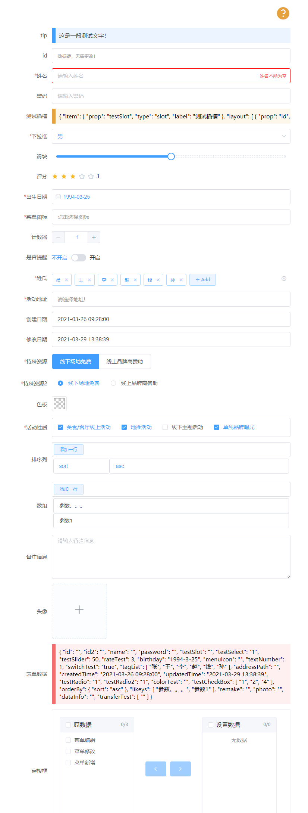
  > 当前布局的配置参数详见[附录1](#附录1)
  >
  >详细代码，请查看源码，详细布局配置请查看 `HelloWorld.vue`

-----

# `ld-forms` 的属性

|关键字|类型|解释|默认值|是否必须|说明|
|-|-|-|-|-|-|
|form|Object|布局参数的数据值|{}|√|在编辑等情况下，需要打开页面就显示组件相关数据值，此时需要通过form来初始化表单数据值|
|layout|Array[Object]|布局参数|[]|√|整个表单需要显示的布局参数。是数组包含一组对象的集合，形如[{...},{...}...]|
|is-overflow-y|Boolean|是否显示纵向(y)滚动条|false|-|form表单的主体是否显示纵向(y)滚动条|
|show-tip-button|Boolean|是否显示提示按钮|false|-|位于表单的右上角提示按钮|
|show-default-tip|Boolean|是否显示默认tip文字|false|-|是否显示位于每个表单子元素组件上的解释说明文字信息|
|label-position|String|左侧文字位置|right|-|组件文字的位置；可选址为：left,right,top|
|label-width|String|左侧文字大小|100px||左侧文字大小|
|is-row|Boolean|是否是行模式|false||true:行模式，通常组件数量较少，且开启后会忽略label-position的值，通常用作布局界面的查询条件|
|cols|Number|form表单的列数|1||可选址为：1,2,3,4|
|auto-save|Boolean|【待定】是否自动保存|true||【待定】该参数暂时无效，相关功能，正在开发中.|
|is-more-level-update-el-date|Boolean|【待定】是否强制刷新Date组件|false||【待定】当前组件封装层数过多时，element-date日期控件会出现不能及时刷新的问题，此时需要设置该属性为 true|


# 如何构建一个form表单 代码如下
```javascript
<template>
  <div style="width: 500px;padding: 10px;">
    <ld-forms :layout="layout" :form="forms"></ld-forms>
  </div>
</template>

<script>
  export default{
    data(){
      return {
        layout:[
          {
            prop:'name', //关键字
            label:'姓名', //显示名称
            type:'text', //组件类型
          }
        ],
        forms:{},
      }
    }
  }
</script>

<style>
</style>

```
  >如上，只需要简单的几行代码，就可以构建一个form表单，当然目前这个表单还很稚嫩，我们需要通过设置`layout`参数值进行健壮它。
## `layout` 数据结构
```javascript
//格式
data(){
    return {
      layout:[
        {},//组件属性
        {},//组件属性
        // ...
      ]
  };
}
```
> 布局文件是 多个子项对象的集合，每个子项包含许多属性，通过属性控制布局显示。
## 通常`ld-forms`的子元素的每个对象都支持如下属性(见下表)：
```javascript
//格式
data(){
    return {
      layout:[
        {
          //必填属性
          prop:'name', //[String]
          label:'姓名',//[String]
          type:'text',//[String(`tip`|`datakey`|`slot`|`text`|`textarea`|`select`|`radio`|`checkbox`|`date`|`icon`|`tag`|`address`|`sysdate`|`image`|`number`|`switch`|`slider`|`rate`|`color`|`transfer`|`param`)]
          //可选属性
          visabled:true,//[Boolean?]true;
          readonly:true,//[Boolean?]false;
          //.....
        }
      ]
  };
}
```
### `ld-forms`的`子元素`通用属性说明

|关键字|类型|解释|默认值|是否必须|说明|
|-|-|-|-|-|-|
|prop				|String|数据字段					|				| √			|关键字，将会成为获取组件值的key,通常和数据库表中的字段名相同|
|label			|String|左侧文字					|				| √			|显示在表单组件左侧的说明文字|
|type				|String|类型							|				| √			|组件类型；当前支持21中组件`tip`,`datakey`,`slot`,`text`,`textarea`,`select`,`radio`,`checkbox`,`date`,`icon`,`tag`,`address`,`sysdate`,`image`,`number`,`switch`,`slider`,`rate`,`color`,`transfer`,`param`|
|require		|Boolean|是否不为空				|false	|					|是否为空。true:不为空，false:可为空|
|placeholder|String|输入提示文字			|				|					|组组件输入提示文字。不设置，则会根据配置类型和`label`设置相关的值。如:'请输入xxx'和'请选择xxx'等|
|msg				|String|错误提示文字			|				|					|组件校验错误提示文字。当非空校验通过时，不满足其他校验条件时显示|
|visabled		|Boolean|是否显示					|true		|					|是否显示;true:显示，false:隐藏|
|readonly		|Boolean|是否只读					|false	|					|是否只读;true:只读，false:可操作|
|disabled		|Boolean|是否禁用					|false	|					|是否禁用;true:禁用，false:可操作；作用和readonly作用相同，通常只需设置一个属性即可|
|regex			|RegExp,String,function	|数据校验					|				|					|校验当前组件值；RegExp:如`/^[1][0-9]{10}$/`校验手机号码；String:如`"/^[1][0-9]{10}$/"`会被断定为正则表达式，"abc"会被断定为字符串，进行值比较；function:如`function(val){  return true  }`设置函数，在函数中会获得当前组件的值`val`，需要返回一个true或者false	|
|tip				|String|辅助提示文字			|				|					|显示在当前组件顶部的辅助解释内容，可以使html字符串|
|tipClass		|String|辅助提示文字样式	|				|					|通常配置`tip`使用，多个class名称，中间用空格隔开|
|css				|String|class样式				|				|					|设置当前组件的class样式|
|style			|String|style样式				|				|					|设置当前组件的style样式|


# `ld-forms`支持的组件类型（`v1.0.0`）


  > 当前支持21种组件类型，且每种的组件类型都支持`通用属性`(见上表)

## tip
 - type=`tip`：文字提示内容；可以在from表单中独居一个form子元素，也可用来说明某一个元素相关信息；
 ```javascript
 //格式
 data(){
     return {
       layout:[
         {
           //必填属性
           prop:'tip', //[String]
           label:'提示文字',//[String]
           type:'tip',
           tip:`<div style="color:red">这是一段测试文字</div>`,
           tipClass:'tip-p b-p1',//可为空，默认为当前样式
         }
         //....更多组件内容
       ]
   };
 }
 ```
  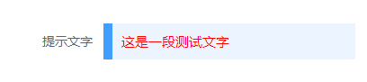
----

## slot
-  type=`slot`：插槽；通过指定定`prop`值，来自定义表单内容
```javascript
  <template>
    <div class="b-i1 w h box-b p10">
      <el-card style="width: 500px;padding: 10px;">
        <ld-forms :layout="layout" :form="forms">

          <!-- 这里的插槽名称customSlot和 prop的值保持一致 -->
          <template #customSlot="e">
            <div>插槽数据：{{e}} </div>
            <!-- 可以通过具名插槽获取到的值，进行自由设置布局 -->
          </template>
        </ld-forms>
      </el-card>
    </div>
  </template>

  <script>
    export default {
      data() {
        return {
          layout: [
          {
             //必填属性
             prop:'customSlot', //[String]
             label:'自定义插槽',//[String]
             type:'slot'
           },
           //....更多组件内容
          ],
          forms: {},
        }
      }
    }
  </script>
```
  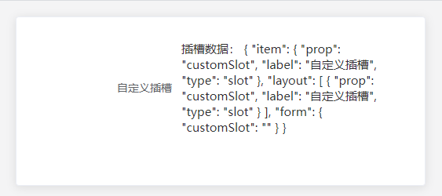

  > 通过自定义插槽实现个性化内容；
----
## text
- `text`：文本输入框；
```javascript
 data() {
      return {
        layout: [{
           //必填属性
           prop:'userName', //[String]
           label:'姓名',//[String]
           type:'text'
         },
         //....更多组件内容
        ],
        forms: {},
      }
    }
```
  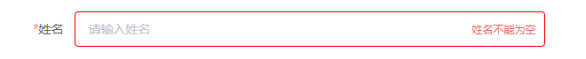
 ### type=`text` 特有属性
|关键字|类型|解释|默认值|是否必须|说明|
|-|-|-|-|-|-|
|password|Boolean|是否密码输入框|false|||
----
----
## textarea
- `textarea`：文本域；
 ```javascript
  data() {
       return {
         layout: [{
            //必填属性
            prop:'remake', //[String]
            label:'备注',//[String]
            type:'textarea',
            rows:4
          },
          //....更多组件内容
         ],
         forms: {},
       }
     }
 ```
  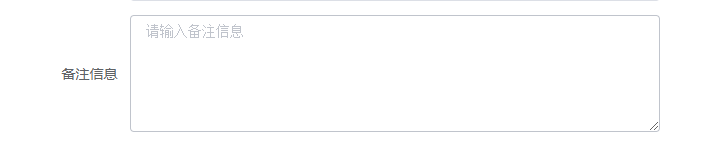
 ### type=`textarea` 特有属性
|关键字|类型|解释|默认值|是否必须|说明|
|-|-|-|-|-|-|
|rows|Number|文本域行数|4||文本域显示的行数,只是显示在界面上的可输入的行数，当超过设定的行数后会出现滚动条|
----
## select
- `select`：下拉框；

 ```javascript
  data() {
       return {
         layout: [{
            //必填属性
            prop:'select', //[String]
            label:'下拉框',//[String]
            type:'select',
            options:[
              {label:'文本一',value:'1'},
              {label:'文本二',value:'2'},
              {label:'文本三',value:'3'},
              {label:'文本四',value:'4'},
            ]
          },
          //....更多组件内容
         ],
         forms: {},
       }
     }
 ```
  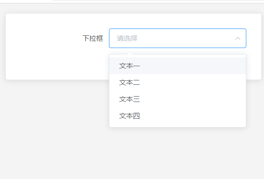
 ### type=`select` 特有属性
|关键字|类型|解释|默认值|是否必须|说明|
|-|-|-|-|-|-|
|options|Array[Object]|下拉框选项值|||下拉框options的选项值，object:{label:'',value:''},label:是现实出现的文字，value:是选择后获取到的值|
|getOptions|Object|远程加载下拉框选项值(`暂时不支持，正在规划中`)|||下拉框options的选项值`暂时不支持`|
|allowCreate   |Boolean|是否允许用户创建新条目，需配合 filterable 使用|false||详情参考[Element-UI select的相关属性](https://element.eleme.cn/#/zh-CN/component/select)|
|filterable    |Boolean|是否可搜索|false||详情参考[Element-UI select的相关属性](https://element.eleme.cn/#/zh-CN/component/select)|
|multiple      |Boolean|是否多选|false||详情参考[Element-UI select的相关属性](https://element.eleme.cn/#/zh-CN/component/select)|
----

## radio
- `radio`：单选组；
  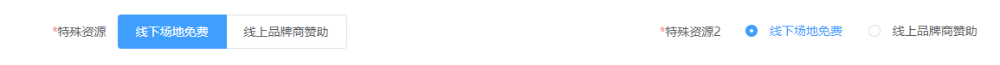
 ### type=`radio` 特有属性
|关键字|解释|类型|默认值|是否必须|说明|
|-|-|-|-|-|-|
|options|Array[Object]|下拉框选项值|||下拉框options的选项值，object:{label:'',value:''},label:是现实出现的文字，value:是选择后获取到的值|
|getOptions|Object|远程加载下拉框选项值(`暂时不支持，正在规划中`)|||下拉框options的选项值`暂时不支持`|
|isButton   |Boolean|是否按钮样式|false||上图左侧是按钮样式，有测试默认样式|
  > 通过`isButton`来控制显示类型
----
## checkbox
- `checkbox`：复选组；

  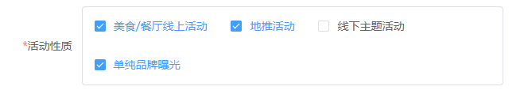

  ### type=`checkbox` 特有属性
|关键字|解释|类型|默认值|是否必须|说明|
|-|-|-|-|-|-|
|options|Array[Object]|下拉框选项值|||下拉框options的选项值，object:{label:'',value:''},label:是现实出现的文字，value:是选择后获取到的值|
|getOptions|Object|远程加载下拉框选项值(`暂时不支持，正在规划中`)|||下拉框options的选项值`暂时不支持`|

----

## date
- `date`：日期组件；支持`Element-ui`中常见的日期类型
  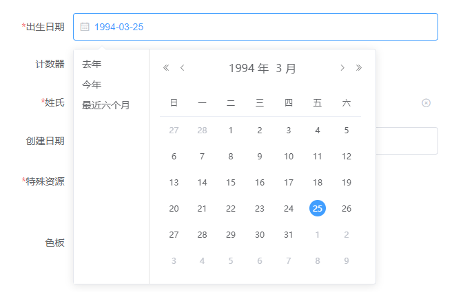

### type=`date` 特有属性
|关键字|类型|解释|可选址|默认值|是否必须|说明|
|-|-|-|-|-|-|-|
|align|String|对齐方式|left, center, right|left||对齐方式|
|dateType|String|日期类型|year/month/date/dates/ week/datetime/datetimerange/ daterange/monthrange|date||日期类型|
|pickerOptions|Object|当前时间日期选择器特有的选项参考下表||||想起参考[Element-UI的日期选择器picker-options](https://element.eleme.cn/#/zh-CN/component/date-picker)|

#### Picker Options
|参数|说明	|类型|可选值|默认值|
|-|-|-|-|-|
|shortcuts|设置快捷选项，需要传入 { text, onClick } 对象用法参考 demo 或下表	|Object[]|	—|	—|
|disabledDate|	设置禁用状态，参数为当前日期，要求返回Boolean|	Function	|—|	—|
|cellClassName|	设置日期的 className	|Function(Date)	|—	|—|
|firstDayOfWeek|	周起始日	|Number	|1 到 7|	7|
|onPick|	选中日期后会执行的回调，只有当 daterange 或 datetimerange 才生效	|Function({ maxDate, minDate })|	—|	—|


  > 可以通过 `dateType`控制日期类型。
  > 支持`year/month/date/dates/week/datetime/datetimerange/daterange/monthrange`
----
## icon
- `icon`：图标组件；使用上文提到的`ld-icon`实现图标选取
  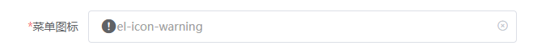
  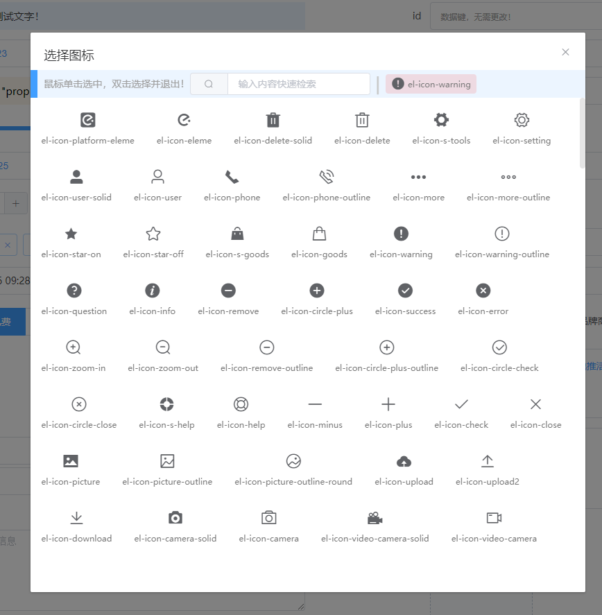
> 仅支持 通用属性
----
## tag
- `tag`：标签组；使用上文提到的`ld-tag`实现标签设置和录入
  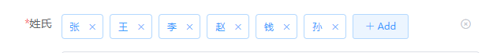

  > 仅支持 通用属性

----
## address
- `address`：地址选择组件；使用上文提到的`id-address`实现标签设置和录入
  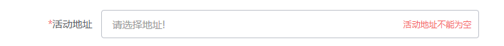
  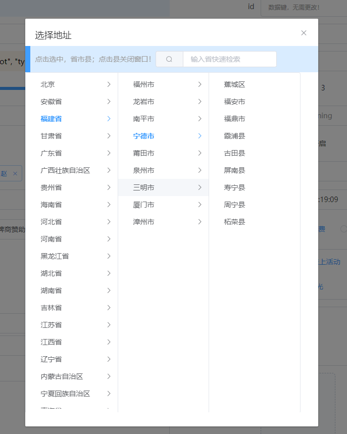

  > 仅支持 通用属性
----
## sysdate
- `sysdate`：系统日期；在使用创建日期和修改日期时非常有用；
  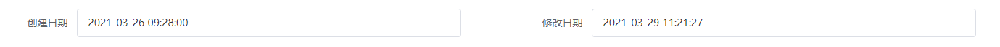
 ### type=`sysdate` 特有属性
|参数|说明	|类型|可选值|默认值|
|-|-|-|-|-|
|update|是否更新，true:会动态更新，false:只会在没有值得情况下获取数据|Boolean|	true,false|	—|
|dateType|日期类型 ，date:yyy-MM-dd ; time:HH:mm:ss ; datetime:yyyy-MM-dd HH:mm:ss |string|	date,time,datetime|	datetime|

  > 创建日期会判断数据是否已经存在值，如果不存在则获取当前日期
  > 修改日期会动态更新，保持获取最新的日期。
----

## image
- `image`：图片上传组；
  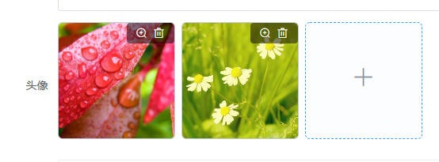
  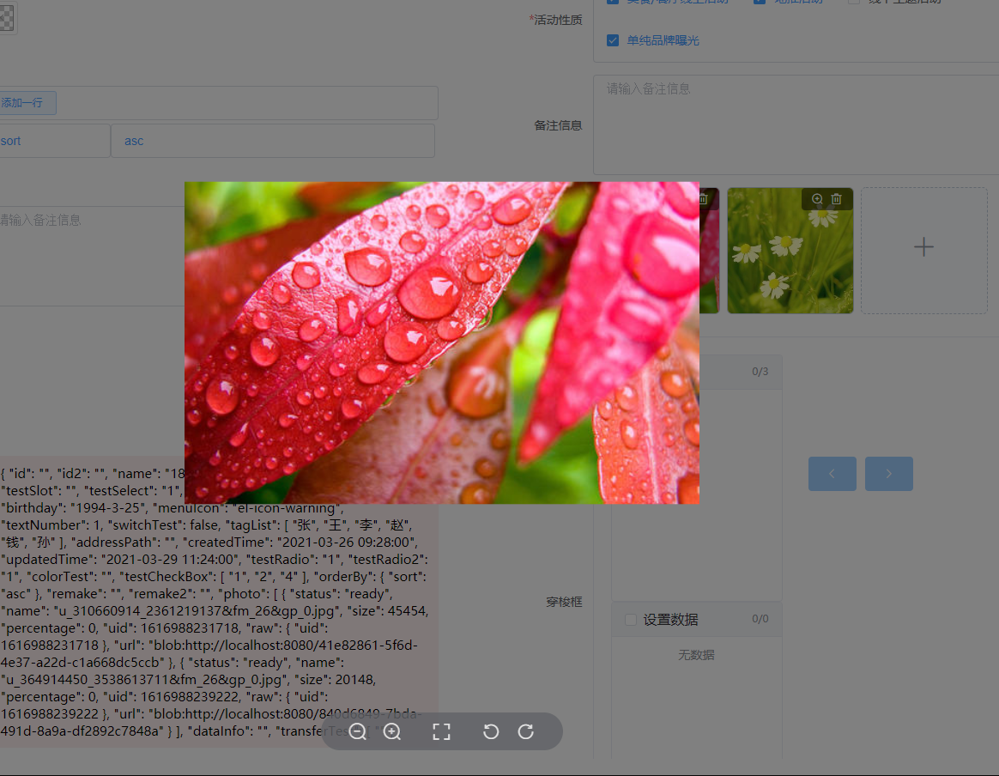
 ### type=`image` 特有属性
|参数|说明	|类型|可选值|默认值|
|-|-|-|-|-|
|limit|图片最大选择数量|Number||	1|

---
## number
- `number`：计数器；
  
 ### type=`number` 特有属性
|参数|说明	|类型|可选值|默认值|
|-|-|-|-|-|
|max|最大值|Number||	1000|
|min|最小值|Number||	0|
|precision|精度，小数点后保留位数|Number||	0|
|step|步长|Number||1|
|stepStrictly|是否只能输入 step 的倍数[Element-UI计数器的step-strictly](https://element.eleme.cn/#/zh-CN/component/input-number)|Boolean||faslse|

---
## switch
- `switch`：开关；
  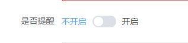
 ### type=`switch` 特有属性
|参数|说明	|类型|可选值|默认值|是否必须|
|-|-|-|-|-|-|
|activeText|switch 打开时的文字描述|string|-|-|可为空|
|inactiveText|switch 关闭时的文字描述|string|-|-|可为空|

---
## slider
- `slider`：滑块;
  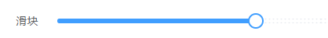
 ### type=`slider` 特有属性
|参数|说明	|类型|可选值|默认值|
|-|-|-|-|-|
|max|最大值|Number||	1000|
|min|最小值|Number||	0|
|showStops|显示间断点|Boolean||true|
|formatTooltip|	格式化 tooltip message|function(value)|-|-|
|marks|标记， key 的类型必须为 number 且取值在闭区间 [min, max] 内，每个标记可以单独设置样式[Element-UI滑块的marks](https://element.eleme.cn/#/zh-CN/component/slider)|object|-|-|

---
## rate
- `rate`：评分；
  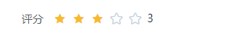
 ### type=`rate` 特有属性
|参数|说明	|类型|可选值|默认值|
|-|-|-|-|-|
|showText|是否显示辅助文字，若为真，则会从 texts 数组中选取当前分数对应的文字内容|boolean||	false|
|showScore|是否显示当前分数，show-score 和 show-text 不能同时为真|boolean||	false|
|texts|辅助文字数组|array||['极差', '失望', '一般', '满意', '惊喜']|
|colors|icon 的颜色。若传入数组，共有 3 个元素，为 3 个分段所对应的颜色；若传入对象，可自定义分段，键名为分段的界限值，键值为对应的颜色|array/object||['#F7BA2A', '#F7BA2A', '#F7BA2A']|

---
## color
- `color`：颜色选择器；
  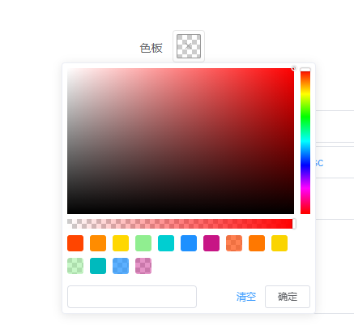
 ### type=`color` 特有属性
|参数|说明	|类型|可选值|默认值|
|-|-|-|-|-|
|showAlpha|是否支持透明度|boolean||true|
|predefine|预定义颜色|Array||['#ff4500','#ff8c00','#ffd700','#90ee90','#00ced1','#1e90ff','#c71585','rgba(255, 69, 0, 0.68)','rgb(255, 120, 0)','hsv(51, 100, 98)','hsva(120, 40, 94, 0.5)','hsl(181, 100%, 37%)','hsla(209, 100%, 56%, 0.73)','#c7158577']|

---
## transfer
- `transfer`：穿梭框；
  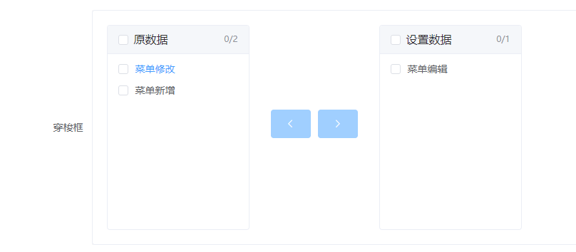
 ### type=`transfer` 特有属性
|参数|说明	|类型|可选值|默认值|
|-|-|-|-|-|
|title|标题,字符串是需要根据配置的分隔字符隔开|String,Array||['原数据','设置数据']或者'原数据\|设置数据'|
|options|预定义颜色|Array||['#ff4500','#ff8c00','#ffd700','#90ee90','#00ced1','#1e90ff','#c71585','rgba(255, 69, 0, 0.68)','rgb(255, 120, 0)','hsv(51, 100, 98)','hsva(120, 40, 94, 0.5)','hsl(181, 100%, 37%)','hsla(209, 100%, 56%, 0.73)','#c7158577']|
|title|标题,字符串是需要根据配置的分隔字符隔开|String,Array||['原数据','设置数据']或者'原数据\|设置数据'|
|leftDefaultChecked|初始状态下左侧列表的已勾选项的 key 数组|array||[]|
|rightDefaultChecked|初始状态下右侧列表的已勾选项的 key 数组|array||[]|

---
## param
- `param`：参数；
  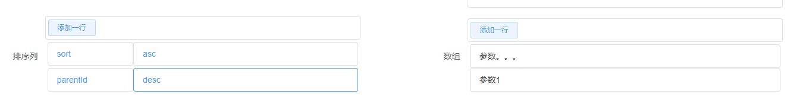
 ### type=`param` 特有属性
|参数|说明	|类型|可选值|默认值|
|-|-|-|-|-|
|dataType|数据类型,注意是`dataType`,不是`dateType`和日期没有关系|String|object,array|-|

---

## datakey
- `datakey`：数据键；只用来在某些特定情况下显示数据；
  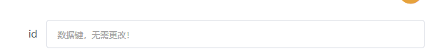
  > 用来显示表单主键，又不想用户能够直接看到主键值；
  >
  > 仅支持 通用属性
----

# `ld-forms`插槽
|slot name|类型|说明|插槽值|
|-|-|-|-|
|buttons|具名插槽(作用域插槽)|表单的最后插槽，同来用来插入操作按钮|{Array}:layout布局信息;{Object}:form表单输入值|
|custom	|具名插槽(作用域插槽)|自定义表单所有子项内容，配置。这意味着，你需要自己来完成许多的表单内容|{Array}:layout布局信息;{Object}:form表单输入值|
|rowCustom	|具名插槽(作用域插槽)|对表单的整个行进行自定义。这意味着你需要自己来完成表单的每个子项|{Object}:item 表单子项布局信息|
|在布局中使用type=slot,插槽名=prop，如{type:'select',prop:'testInfo',label:'测试信息'}，则插槽名为：'testInfo'	|具名插槽(作用域插槽)|对表单行的输入部分进行自定义|{Array}:layout布局信息;{Object}:form表单输入值;{Object}:item 表单子项布局信息|
|在布局中使用type=select,插槽名=options_${prop值}，如{type:'select',prop:'testInfo',label:'测试信息'}，则插槽名为：'options_testInfo'|具名插槽(作用域插槽)|对表单行的下拉框选项值部分进行自定义|{Object}:option,下拉框的option信息|


[回首页](./README.md)
# `ld-forms`事件
  ## 组件联动和联动后的数据更改
  > 通过在`layout`布局参数的子项中设置 `change`事件，来控制联动或联动后更新相关数据；

- 联动控制组件

  ```javascript
data(){
  return {
    layout:[

      {
        prop: 'testRadio',
        type: 'radio',
        label: '特殊资源',
        options: [{
            label: '线下场地免费',
            value: '1'
          },
          {
            label: '线上品牌商赞助',
            value: '0'
          }
        ],
        //联动事件
        change:(val,event)=>{
          return {
            //prop:{元素具备的属性}
            addressName:{
              visabled:val==1 //当 val==1时，将组件prop='addressName'组件的visabled(可见)设为true(显示)
            },
            sponsorship:{
              visabled:val==0 //当 val==0时，将组件prop='sponsorship'组件的visabled(可见)设为true(显示)
            },
          }
        }
      },

      {
        prop: 'addressName',
        type: 'textarea',
        label: '场地名称',
        visabled:true,
      },
      {
        prop: 'sponsorship',
        type: 'text',
        label: '赞助商名称',
        visabled:false,
      },
    ]
  };
}
  ```

- 联动控制整个表单的数据

```javascript
data(){
  return {
    layout:[
      {
        prop: 'testRadio',
        type: 'radio',
        label: '特殊资源',
        options: [{
            label: '线下场地免费',
            value: '1'
          },
          {
            label: '线上品牌商赞助',
            value: '0'
          }
        ],
        //联动事件
        change:(val,event)=>{
          return {
            /**
             * 通过form关键字进行操作
             * 可使用Function(value,event)函数  或者  Object对象进行操作
             *
             */
            //方式1： 通过Object进行设置
            form:{
                //prop:value
               textInfo:value==1 ? '123456' : 'abcde'
             },
             //方式2；使用function(value,event)函数设置元素的值
             form:(value,event)=>{
               let form=event['form'];
               form['textInfo']=val==1 ? '123456' : 'abcde';
               return form;
             }
          }
        }
      },
      {
        prop: 'textInfo',
        type: 'text',
        label: '场地名称',
        visabled:true,
      },
    ]
  };
}
```

- 联动控制整个表单的布局

```javascript
data(){
  return {
    layout:[
      {
        prop: 'testRadio',
        type: 'radio',
        label: '特殊资源',
        options: [{
            label: '线下场地免费',
            value: '1'
          },
          {
            label: '线上品牌商赞助',
            value: '0'
          }
        ],
        //联动事件
        change:(val,event)=>{
          return {
            /**
             * 通过layout关键字进行操作
             * 与from相似，同样可使用Function(value,event)函数  或者  Array对象进行操作
             *
             */
            //方式1： 通过Object进行设置
            layout:[
              //{}
              {prop:'textInfo',type:'select',options:[{label:'测试1',value:'1'},{label:'测试2',value:'2'}],label:'修改为select'}
             ],

            //方式2；使用function(value,event)函数设置元素的值
            layout: (value, event) => {
              let layout = event['layout'];
              let item = layout.filter(item => item.prop == 'textInfo');
              if (item.length <= 0) {
                return layout;
              }
              let index = layout.indexOf(item[0]);
              item=item[0];
              //重新修改textInfo结构
              item['type'] = val != 1 ? 'text' : 'select';
              item['label'] = val != 1 ? '文本框': '修改为select';
              item['readonly'] = false;
              item['options'] = val != 1 ? [] : [{
                label: '测试1',
                value: '1'
              }, {
                label: '测试2',
                value: '2'
              }];
              layout[index] = item;
              return layout;
            }
          }
        }
      },
      {
        prop: 'textInfo',
        type: 'text',
        label: '场地名称',
        visabled:true,
      },
    ]
  };
}
```

> 可以使用代码实现下图的效果

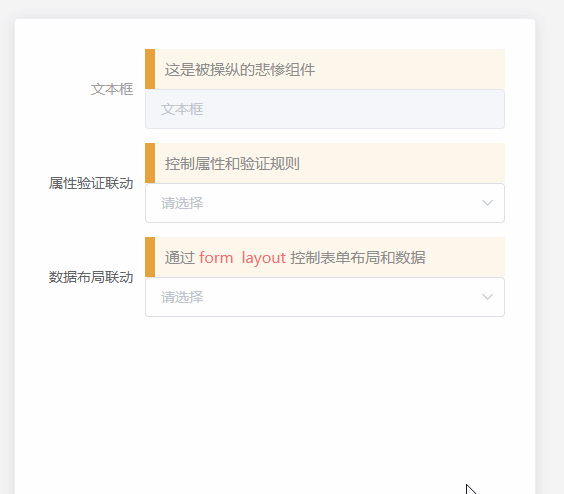

```javascript
<template>
  <!-- 元素联动 -->
  <div class="b-i1 w h box-b p10">
    <el-card class="f-s" style="width: 500px;padding: 10px;height: 500px;">
      <ld-forms :layout="layout" :form="forms" :show-default-tip="true">
      </ld-forms>
    </el-card>
  </div>
</template>

<script>
  export default {
    data() {
      return {
        layout: [
          {
            prop: 'textInfo',
            type: 'text',
            tip:'这是被操纵的悲惨组件',
            label: '文本框',
            readonly: true,
            visabled: true,
          },{
            //必填属性
            prop: 'select',
            tip:'控制属性和验证规则',
            label: '属性验证联动',
            type: 'select',
            options: [{
                label: '修改提示名称',
                value: '1'
              },
              {
                label: '修改为只读',
                value: '2'
              },
              {
                label: '设置为必填项',
                value: '3'
              },
              {
                label: '隐藏文本框',
                value: '4'
              },
              {
                label: '使用函数验证4-6为数字',
                value: '5'
              },
              {
                label: '使用正则验证4-6为汉字',
                value: '6'
              },
              {
                label: '修改为密码框',
                value: '7'
              },
            ],
            change: (val, event) => {
              return {
                textInfo: {
                  label: val == '1' ? '修改后的名称' : '文本框',
                  readonly: val == '2',
                  require: val == '3'||val=='7',
                  visabled: val != '4',
                  password:val=='7',
                  //使用正则和 函数混合使用
                  regex: val=='6' ? /^[\u4e00-\u9fa5]{4,6}$/ : (textVal) => {
                    return function(textVal) {
                      debugger
                      if (val != "5"&&val!='7') {
                        return true;
                      }
                      return /^[0-9]{4,6}$/.test(textVal);
                    }
                  },
                  msg: val=='6' ? '名称必须为汉字' : '',
                },
              }
            }
          },

          {
            //必填属性
            prop: 'changeType',
            tip:`通过<span class='c-d p2'>form</span><span class='c-d p2'>layout</span>控制表单布局和数据`,
            label: '数据布局联动',
            type: 'select',
            options: [{
              label: '修改为select',
              value: '1'
            },{
              label: '修改为text',
              value: '2'
            }],
            change: (val, event) => {
              return {
                /**
                 * 通过form关键字进行操作
                 * 可使用Function(value,event)函数  或者  Object对象进行操作
                 *
                 */

                //方式1： 通过Object进行设置
                // form: {
                //   textInfo: ['7', '8', '9'].includes(val) ? '123456' : ''
                // },
                //方式2；使用function(value,event)函数设置元素的值
                form: (value, event) => {
                  debugger
                  let form = event['form'];
                  form['textInfo'] =val==2 ? '123456' : '';
                  return form;
                },

                /**
                 * 通过layout关键字进行操作
                 * 与from相似，同样可使用Function(value,event)函数  或者  Array对象进行操作
                 *
                 */

                //方式1： 通过Object进行设置
                // layout: [
                //   {
                //     prop: 'textInfo',
                //     type: 'select',
                //     options: [{
                //       label: '测试1',
                //       value: '1'
                //     }, {
                //       label: '测试2',
                //       value: '2'
                //     }],
                //     label: '修改为select'
                //   }
                // ],

                //方式2；使用function(value,event)函数设置元素的值
                layout: (value, event) => {
                  let layout = event['layout'];
                  let item = layout.filter(item => item.prop == 'textInfo');
                  if (item.length <= 0) {
                    return layout;
                  }
                  let index = layout.indexOf(item[0]);
                  item=item[0];
                  //重新修改textInfo结构
                  item['type'] = val != 1 ? 'text' : 'select';
                  item['label'] = val != 1 ? '文本框': '修改为select';
                  item['readonly'] = false;
                  item['options'] = val != 1 ? [] : [{
                    label: '测试1',
                    value: '1'
                  }, {
                    label: '测试2',
                    value: '2'
                  }];
                  layout[index] = item;
                  return layout;
                }
              }
            }

          }
        ],
        forms: {},
      }
    }
  }
</script>
```


# 附录1
```html
<template>
  <ld-page-loading :loading="loading" class="box-b" style="height: calc(100vh - 20px);">
    <div class="w h f-c over-a-y ">
      <ld-forms :cols="1" :form="forms" :show-tip-button="true" :layout="layouts" class="w h box-b" style="width:820px;">
        <!-- 单独行插槽 插槽名称和 prop值相同 -->
        <!-- <template v-slot:rowCustom="e">{{e}}</template> -->
        <!-- 单独行的 录入元素插槽 -->
        <template v-slot:testSlot="e">
          <div class="tip-w b-w1 ellipsis w"> {{e}}</div>
        </template>
        <template v-slot:dataInfo="e">
          <div class="tip-d b-d1"> {{e.form}}</div>
        </template>


        <!-- form表单插槽 -->
        <!-- <template v-slot:custom="e">{{e}}</template> -->

        <!-- form按钮插槽-->
        <template v-slot:buttons="e">
          <div class="w f-c">
            <el-button @click="saveData">保存</el-button>
          </div>
        </template>


      </ld-forms>
    </div>
  </ld-page-loading>
</template>
```
```javascript

layouts: [{
    prop: 'id',
    type: 'tip',
    tip: `这是一段测试文字！`,
    tipClass: 'tip-p b-p1',
    label: 'tip',
    showLabel: true
  }, {
    prop: 'id2',
    type: 'datakey',
    label: 'id'
  }, {
    prop: 'name',
    type: 'text',
    label: '姓名',
    css: 'c-d',
    style: 'color:red;',
    tip: `<div>姓名必须是<span class="c-d">3-6</span>个字符</div>`,
    tipClass: 'tip-d b-d1 p1 fs12',
    require: true
  }, {
    prop: 'password',
    type: 'text',
    password: true,
    tip: `<div>密码必须是<span class="c-d">6-12</span>个字符</div>`,
    label: '密码'
  }, {
    prop: 'testSlot',
    type: 'slot',
    label: '测试插槽',
  }, {
    prop: 'testSelect',
    type: 'select',
    label: '下拉框',
    options: [{
        label: '男',
        value: '1'
      },
      {
        label: '女',
        value: '0'
      },
    ],
    change: (val, event) => {
      return {
        height: {
          label: val == '1' ? '男生身高' : '女生身高'
        },
        birthday: {
          require: val == '1'
        }
      }
    },
    value: '1',
    regex: (val) => {
      return val == 1
    },
    require: true
  },
  {
    prop: 'height',
    type: 'text',
    label: '身高',

  },
  {
    prop: 'testSlider',
    type: 'slider',
    label: '滑块',
    value: 50,
  },
  {
    prop: 'rateTest',
    type: 'rate',
    label: '评分',
    value: 3,
    showScore: true
  },
  {
    prop: 'birthday',
    dateType: 'date',
    type: 'date',
    label: '出生日期',
    value: "1994-3-25",
    pickerOptions: {
      shortcuts: [{
        text: '去年',
        onClick(picker) {
          const start = new Date();
          start.setFullYear(start.getFullYear() - 1);
          picker.$emit('pick', start);
        }
      }, {
        text: '今年',
        onClick(picker) {
          const date = new Date();
          picker.$emit('pick', date);
        }
      }, {
        text: '最近六个月',
        onClick(picker) {
          const start = new Date();
          start.setMonth(start.getMonth() - 6);
          picker.$emit('pick', start);
        }
      }]
    },
    require: true,
  },
  {
    prop: 'menuIcon',
    type: 'icon',
    label: '菜单图标',
    require: true,
  },
  {
    prop: 'textNumber',
    type: 'number',
    label: '计数器',
    placeholder: '折扣',
    min: '1',
    max: '10',
    value: '1',
  }, {
    prop: 'switchTest',
    type: 'switch',
    label: '是否提醒',
    value: 'true',
    activeText: "开启",
    inactiveText: "不开启",
  }, {
    prop: 'tagList',
    type: 'tag',
    label: '姓氏',
    parseType: 'split',
    value: '张|王|李|赵| 钱 |孙',
    require: true,
  },
  {
    prop: 'addressPath',
    type: 'address',
    label: '活动地址',
    require: true,
  },
  {
    prop: 'createdTime',
    dateType: 'dateTime',
    type: 'sysdate',
    label: '创建日期',
    update: false,
    value: '2021-03-26 09:28:00'
  },
  {
    prop: 'updatedTime',
    dateType: 'dateTime',
    type: 'sysdate',
    label: '修改日期',
    update: true,
    value: '2021-03-26 09:28:00'
  },
  {
    prop: 'testRadio',
    type: 'radio',
    label: '特殊资源',
    isButton: true,
    options: [{
        label: '线下场地免费',
        value: '1'
      },
      {
        label: '线上品牌商赞助',
        value: '0'
      }
    ],
    value: '1',
    require: true,
    change:(val,event)=>{
      return {
        addressName:{
          visabled:val==1
        },
        sponsorship:{
          visabled:val==0
        },
      }
    }
  },
  {
    prop: 'addressName',
    type: 'textarea',
    label: '场地名称',
    visabled:true,
  },
  {
    prop: 'sponsorship',
    type: 'text',
    label: '赞助商名称',
    visabled:false,
  },
  {
    prop: 'testRadio2',
    type: 'radio',
    label: '特殊资源2',
    options: [{
        label: '线下场地免费',
        value: '1'
      },
      {
        label: '线上品牌商赞助',
        value: '0'
      }
    ],
    value: '1',
    require: true,
  },
  {
    prop: 'colorTest',
    type: 'color',
    label: '色板',
  },
  {
    prop: 'testCheckBox',
    type: 'checkbox',
    label: '活动性质',
    options: [{
        label: '美食/餐厅线上活动',
        value: '1'
      },
      {
        label: '地推活动',
        value: '2'
      },
      {
        label: '线下主题活动',
        value: '3'
      },
      {
        label: '单纯品牌曝光',
        value: '4'
      },
    ],
    parseType: 'split',
    require: true,
    value: "1|2 |4 "
  }, {
    prop: 'orderBy',
    type: 'param',
    label: '排序列',
    dataType: 'object',
    parseType: 'json',
    value: JSON.stringify({
      "sort": "asc"
    })
  }, {
    prop: 'likeys',
    type: 'param',
    label: '数组',
    dataType: 'arra',
    parseType: 'json',
    value: JSON.stringify(["参数。。。", "参数1"])
  }, {
    prop: 'remake',
    type: 'textarea',
    password: true,
    label: '备注信息',
    regex: /^.{4,}$/,
    rows: 5
  }, {
    prop: 'photo',
    type: 'image',
    label: '头像',
    limit: 4,
  }, {
    prop: 'dataInfo',
    type: 'slot',
    label: '表单数据',
  },
  {
    prop: 'transferTest',
    type: 'transfer',
    label: '穿梭框',
    parseType: 'split', //-------------
    options: [{
        label: '菜单编辑',
        value: '1'
      },
      {
        label: '菜单修改',
        value: '2'
      },
      {
        label: '菜单新增',
        value: '3'
      },
    ],
    splitChart: ','
  }
]


```
